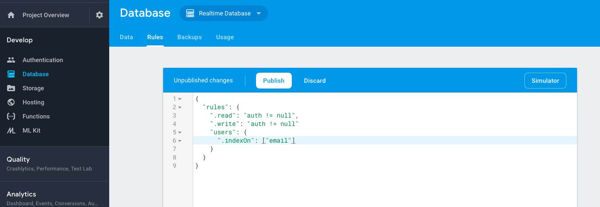
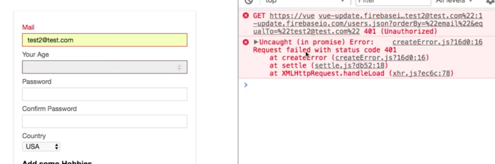
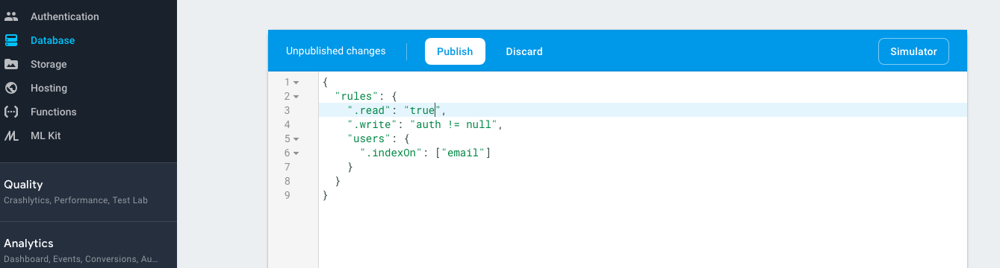
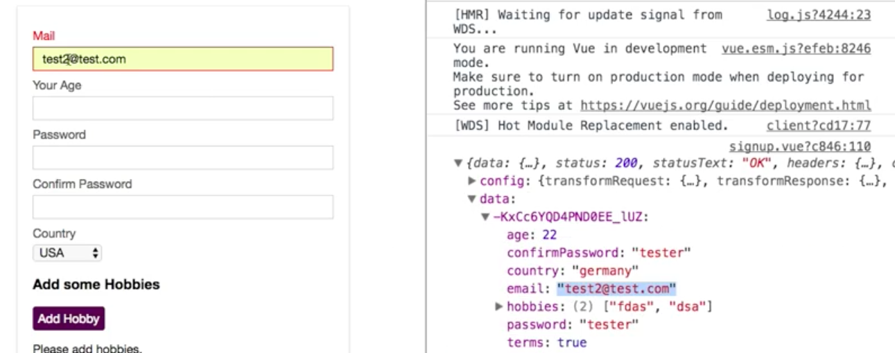

# Async Validators

How can we turn our `custom validator` into asynchronous one? For that in our `custom validator` we need to return a `promice` and `vuelidator` then will be able automatically handle this. First of all in the `unique validator` we'll check if value is an empty string `val === ''`, in which case we'll return `true`. Then we should return `new Promise()` which takes two arguments: `resolve` and `reject` - `new Promise((resolve, reject) => )` - and in this `function` we can call `resolve()` to simulate we got a `value`, and in the `resolve()` we can resolve to `true` of `false` which return synchronously. 

```js
unique: val => {
          if (val === '') return true
          return new Promise ((resolve, reject) => {
              resolve(val === 'test@test.com')  //resolve to true or false
          })
        }
```
It could be asunchronous if we add for example `setTimeout()` function. 

```js
unique: val => {
          if (val === '') return true
          return new Promise ((resolve, reject) => {
              setTimeout( () => {
                  resolve(val !== 'test@test.com') 
              },1000)
          })
        }
```

Now let's go back to the `Firebase` where we store email addresses, and adjust `Database`. We in the end want to find out whether one of our users in the Database has an `email address` we alredy registered. For this we need to create so called `index` in the `database rules` set. We go to `Rules` and add a key for `users` reffering to our users node, this will hold an `object` and in this object we'll add a special `.indexOn` key. It tells `Firebase` "There is a key in my users, which i want to be able to curry". This  `.indexOn` key is an `array`, where we can define `email`.



Once we publish it, we can search in the `database` by email in all our `user objects`. And now we can write the code to actually reach out to our `server` and see if a certain `email address` is already taken. In our `unique validator` instead of returning the `Promise` we can return the `result of axios request`. For that we need to import `axios` in the script section in the `signup.vue` file. Then axios has `get()` method to get a request, and we want to send it to  `'/users.json'`, we don't want to reach it only like this, we want to order our `data`, we want to see if the `email address` exists. To filter this on `Firebase` we need to pass a `query` parameter  - `?orderBy=` and then should be "email" (between doulbe quotation marks, that's important here), email refers to the `email node` in our `users`, and then we'll chain the ctiteria `&equalTo=`, and here the `eamil address` now should be passed, so we'll add `val`  - `return axios.get('/users.json?orderBy="email"&equalTo="' + val + '"')`. Then axios gives us the `promise` and we are not returnig the result of that `promise` because that wii not be `true` of `false`,but the `http response`. So, in the `then()` block we instead for now will have a look at that `response` and then return `false` (we'll fix this later) which will be wraped in to a `promise` and therefore can now be used by `vuelidate`. 

```js
unique: val => {
          if (val === '') return true  
          return axios.get('/users.json?orderBy="email"&equalTo="' + val + '"') 
            .then(res => {
              console.log(res)
              return false
            })
        }    
```

Now if we enter `email address` we'll got an error, we get `unauthorised request` because we required all users to log in. To change that we need to change the `read riles` in the `Firebase database` to just `true`. 




Now if in the app we type `email address` again, we'll get a `response`, and the `response` is the `object` where the `email address` matches. 



If we enter the `email address` which we don't have, we'll get back an empty `object`. If we get back an `empty object`, we know that the `email address` is still available. So, let's return now a check which checks if `responce data` - that is where the empty object will be stored. How do we find out if it is an empty object? We can take advantage on the `built-in method` on `object` in java script, there is a `keys()` method whic we can use on the `response data`, and this will gives us back an `array` of all the `keys` this `object` has, and check if the `length` is equal to `0` - we know it's an empty object -  `Object.keys(res.data).length === 0`. And then we wanna return `true` because that means the user picked the `email address` for which we don't find `data` on the `server`. 

**signup.vue**
```html
<template>
  <div id="signup">
    <div class="signup-form">
      <form @submit.prevent="onSubmit">
        <div class="input" :class="{invalid: $v.email.$error}"> 
          <label for="email">Mail</label>
          <input
                  type="email"
                  id="email"
                  @blur="$v.email.$touch()"        
                  v-model="email">    
                  <p v-if="!$v.email.email">Please, provide a valid email address</p> 
                  <p v-if="!$v.email.required">This field must not be empty</p>
        </div>
        <div class="input" :class="{invalid: $v.age.$error}"> 
          <label for="age">Your Age</label>
          <input
                  type="number"
                  id="age"
                  @blur="$v.age.$touch()"     
                  v-model.number="age">  
                  <p v-if="!$v.age.minVal">You have to be at least {{ $v.age.$params.minVal.min}} years old.</p>  
        </div>
        <div class="input" :class="{invalid: $v.password.$error}"> 
          <label for="password">Password</label>
          <input
                  type="password"
                  id="password"
                  @blur="$v.password.$touch()"  
                  v-model="password">
        </div>
        <div class="input" :class="{invalid: $v.confirmPassword.$error}">
          <label for="confirm-password">Confirm Password</label>
          <input
                  type="password"
                  id="confirm-password"
                  @blur="$v.confirmPassword.$touch()"  
                  v-model="confirmPassword">
        </div>
        <div class="input">
          <label for="country">Country</label>
          <select id="country" v-model="country">
            <option value="usa">USA</option>
            <option value="india">India</option>
            <option value="uk">UK</option>
            <option value="germany">Germany</option>
          </select>
        </div>
        <div class="hobbies">
          <h3>Add some Hobbies</h3>
          <button @click="onAddHobby" type="button">Add Hobby</button>
          <div class="hobby-list">
            <div
                    class="input"
                    v-for="(hobbyInput, index) in hobbyInputs"
                    :class="{invalid: $v.hobbyInputs.$each[index].$error}" 
                    :key="hobbyInput.id">  
              <label :for="hobbyInput.id">Hobby #{{ index }}</label>
              <input
                      type="text"
                      :id="hobbyInput.id"
                      @blur="$v.hobbyInputs.$each[index].value.$touch()"
                      v-model="hobbyInput.value">  
              <button @click="onDeleteHobby(hobbyInput.id)" type="button">X</button>
            </div>
             <p v-if="!$v.hobbyInputs.minLen">You have to specify at least {{ $v.hobbyInputs.$params.minLen.min }} hobbies.</p>  
             <p v-if="!$v.hobbyInputs.required">Please add hobbies.</p> 
          </div>
        </div>
        <div class="input inline" :class="{invalid: $v.terms.$invalid}">   
          <input type="checkbox" 
          id="terms" 
          @change="$v.terms.$touch()"               
          v-model="terms">    
          <label for="terms">Accept Terms of Use</label>
        </div>
        <div class="submit">
          <button type="submit">Submit</button>
        </div>
      </form>
    </div>
  </div>
</template>

<script>
  import {required, email, numeric, minValue, minLength, sameAs, requirdUnless} from 'vuelidate/lib/validators' 
   import axios from 'axios'  //import axios here
  export default {
    data () {
      return {
        email: '',
        age: null,
        password: '',
        confirmPassword: '',
        country: 'usa',
        hobbyInputs: [],
        terms: false
      }
    },
    validations: {        
       email:{
        required,      
        email,
        unique: val => {
          if (val === '') return true  
          return axios.get('/users.json?orderBy="email"&equalTo="' + val + '"') //return the result of axios request
            .then(res => {
              return Object.keys(res.data).length === 0  //check if empty object
            })
        }    
       },
       age: {      
        required,     
        numeric,
        minVal: minValue(18)    
       },
       password:{         
         required,
         minLen: minLength(6)    
       },
       confirmPassword:{       
        sameAs: sameAs('password')  
       //sameAs: sameAs(vm=>{       
      //   return vm.password
       //})
       },
       terms: {            
        required: requiredUnless(vm=>{
            return vm.country === 'india'
        }) 
       },
       hobbyInputs:{   
        required,    
        minLen: minLength(2),  
        $each: {
           value:{       
            required,       
            minLen: minLength(5)    
           }
        }
       }  
    }, 
    methods: {
      onAddHobby () {
        const newHobby = {
          id: Math.random() * Math.random() * 1000,
          value: ''
        }
        this.hobbyInputs.push(newHobby)
      },
      onDeleteHobby (id) {
        this.hobbyInputs = this.hobbyInputs.filter(hobby => hobby.id !== id)
      },
      onSubmit () {
        const formData = {
          email: this.email,
          age: this.age,
          password: this.password,
          confirmPassword: this.confirmPassword,
          country: this.country,
          hobbies: this.hobbyInputs.map(hobby => hobby.value),
          terms: this.terms
        }
        console.log(formData)
        this.$store.dispatch('signup', formData)
      }
    }
  }
</script>

<style scoped>
  .signup-form {
    width: 400px;
    margin: 30px auto;
    border: 1px solid #eee;
    padding: 20px;
    box-shadow: 0 2px 3px #ccc;
  }

  .input {
    margin: 10px auto;
  }

  .input label {
    display: block;
    color: #4e4e4e;
    margin-bottom: 6px;
  }

  .input.inline label {
    display: inline;
  }

  .input input {
    font: inherit;
    width: 100%;
    padding: 6px 12px;
    box-sizing: border-box;
    border: 1px solid #ccc;
  }

  .input.inline input {
    width: auto;
  }

  .input input:focus {
    outline: none;
    border: 1px solid #521751;
    background-color: #eee;
  }

  .input select {
    border: 1px solid #ccc;
    font: inherit;
  }

   .input.invalid label{      
      color: red
  }

  .input.invalid input{      
      border: 1px solid red;
      background-color: #ffc9aa
  }

  .hobbies button {
    border: 1px solid #521751;
    background: #521751;
    color: white;
    padding: 6px;
    font: inherit;
    cursor: pointer;
  }

  .hobbies button:hover,
  .hobbies button:active {
    background-color: #8d4288;
  }

  .hobbies input {
    width: 90%;
  }

  .submit button {
    border: 1px solid #521751;
    color: #521751;
    padding: 10px 20px;
    font: inherit;
    cursor: pointer;
  }

  .submit button:hover,
  .submit button:active {
    background-color: #521751;
    color: white;
  }

  .submit button[disabled],
  .submit button[disabled]:hover,
  .submit button[disabled]:active {
    border: 1px solid #ccc;
    background-color: transparent;
    color: #ccc;
    cursor: not-allowed;
  }
</style>
```

**ONE IMPORTANT NOTE** here => now we are validating on the `@blur` event, that means we don't send that many `requests` to the `backend`, we send only after the user entered smth. If we were to use the `@input` event which is fired on every keystroke there is the danger of `spamming our backend` with the `requests` because the `request` gets sent whenever the `custom validator` runs. And then we'll probably want to add some additional logic to group all `requests` and not send every request, but add some `delay` inbetween to not hit the `server` with too many requests.  