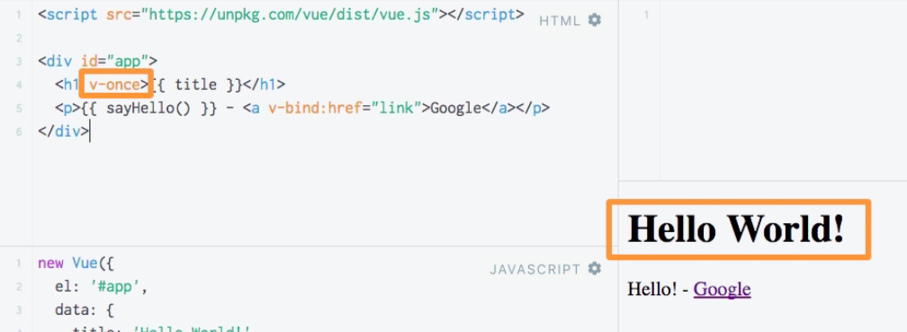

# Disable Re-Rendering with `v-once`

A `directive` is basically an instruction you place in your code. VueJS shifts with the build-in `directives`.
Let's say we have a `title` and we output `{{title}}`. 

**HTML**

```html
<script src=="https://cdn.jsdelivr.net/npm/vue/dist/vue.js"></script>
<div id="app">
<h1>{{title}}</h1> <!--a title here-->
<p>{{ sayHello() }} - <a v-bind:href="link">Google</a></p>  <!--directive here-->
</div>
```
In our `sayHello` function we say `title` equals just "Hello!"
**JS**

```js
new Vue ({
el : '#app'
data : {
    title : 'Hello World!',
    link: 'http://google.com'
}
methods : {
    sayHello: function(){
        this.title = "Hello!";
        return this.title; 
    }
}
})
```
We'll get "Hello!" twice, cos when we execute `sayHello` function we are overriding the `value` of title with setting it to just "Hello!". So, we are outputting "Hello!" in both places. 


#### Keep in mind!
All usages of `title` get re-rendered once the property changes. 

What if in the `title` we wanna to stick to the first, initial `value` the `title` had. And don't want to change this if it changes later in our code. There is a `directive` which we can attach to our `html` element which holds the interpolation (`{{}}`), which is called `v-once`. By adding this to an `element`, all the content inside that element will only be rendered once. It will not be updated if it changes later on. 

**HTML**

```html
<script src=="https://cdn.jsdelivr.net/npm/vue/dist/vue.js"></script>
<div id="app">
<p>{{ sayHello() }} - <a v-bind:href="link">Google</a></p>  <!--directive here-->
<h1 v-once>{{title}}</h1> <!--a directive here-->
</div>
```



