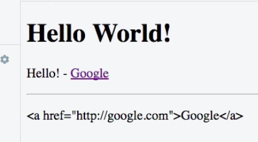

# How to Output Raw HTML

Let's say we also have `finishedLink` property. And unlike the `link` this is not just URL, but a complete `anchor tag`. It should also lead to `google.com`. The important thing here - this is a complete link. We output our `finishedLink` in another `paragraph`.

**HTML**

```html
<script src=="https://cdn.jsdelivr.net/npm/vue/dist/vue.js"></script>
<div id="app">
<h1>{{title}}</h1> 
<p>{{ sayHello() }} - <a v-bind:href="link">Google</a></p>  
<hr>
<p>{{ finishedLink }}</p> <!--output finishedLink-->
</div>
```
**JS**

```js
new Vue ({
el : '#app'
data : {
    title : 'Hello World!',
    link: 'http://google.com',
    finishedLink: '<a href="http://google.com">Google</a>' // new property
}
methods : {
    sayHello: function(){
        this.title = "Hello!";
        return this.title; 
    }
}
})
```
Now as a result we'll see our `link` as text - `html element` in text form. This is the default behavior of VueJS. It means it doesn't render `html elements`, it renders just text. 



**BUT**. If we got some `html` content where you know that the source it is coming from is safe or you did standartised it on your own before output it, in such a case we might want to output the `html` code and not just the text. 
For such a use case we can get rid of the `interpolation syntax` and instead use a `directive`. This `directive` would be placed then on the `element` where you want to output the `html` code. This `directive` called - `v-html`. This allows us then pass the name of the `property`, which holds the `html` code. 

**HTML**

```html
<script src=="https://cdn.jsdelivr.net/npm/vue/dist/vue.js"></script>
<div id="app">
<h1>{{title}}</h1> 
<p>{{ sayHello() }} - <a v-bind:href="link">Google</a></p>  
<hr>
<p v-html="finishedLink"></p> <!--v-html directive-->
</div>
```
