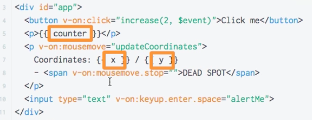
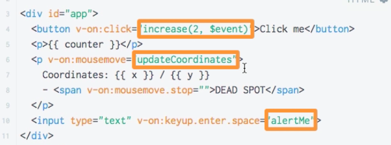
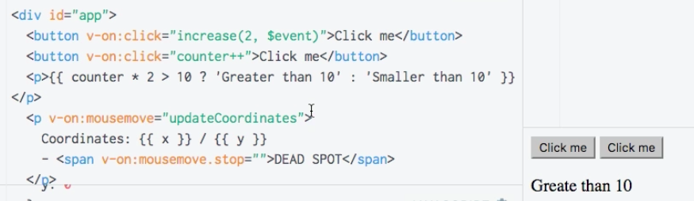

# Writing JavaScript Code in the Templates

Most of the time whem we output something, we output a single `property`. 

We also could call a `function` - that is the way we mostly use for `events` (we pass a reference to a ` function`, to a `method` we wanna execute). 

Be aware that all the places where you can access your `vue instance`, you can write any valid JS code as long as only one expression. So, simple JS statements can be evaluated here. 

