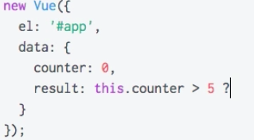

# Reacting to Changes with Computed Properties

  We know how to  use `counter` in dependance of `events` (e.g when we click the `button` we change some `property`). Imagine our `counter variable` would be used in a lot of different places, a lot of other `properties` will depend on this `counter`. It could quickly get problematic to manage them all in `increase` function. Or imagine you have another place where you set this `counter` - then you would need to keep both in sync and that is really hard to maintain. 
  Thankfully `VueJS` makes much more easier cross-property dependance.

  ### Example

  **HTML**

```html
<script src="https://unpkg.com/vue/dist/vue.js"></script>

<div id="app">
  <button v-on:click="counter++">Increase</button> <!--increase counter here-->
  <button v-on:click="counter--">Decrease</button> <!--decrease counter here-->
  <p>Counter: {{ counter }}</p>
  <p>Result: {{ result() }}</p>
</div>
```

How do we update our `result`? We can't set the logic in `data` property, cos the `data` property is **`non-reactive`**.
  
  **This will not work!!!!!:**

 

But we do have a way to still do that. We add a `result` method in our `vue instance`, and all we could do here is  - return the statement where we check if `counter` is greater than `5`, in which case we could say: 'Greater than `5`', if not: 'Smaller than `5`'. Then we can call `resul` method in html. 

**JS**

```js
new Vue({
	el: '#app',
  data: {
  	counter: 0,
    secondCounter: 0
  },
  methods: {
  	result: function() {               //add method here 
    	console.log('Method');
    	return this.counter > 5 ? 'Greater 5' : 'Smaller than 5';
    }
  }
});
```

Well, this way still has a disadvantage! If we add a third `button` and do somethig tottaly different.

**HTML**

```html
<script src="https://unpkg.com/vue/dist/vue.js"></script>

<div id="app">
  <button v-on:click="counter++">Increase</button>
  <button v-on:click="counter--">Decrease</button> 
  <button v-on:click="secondCounter++">Increase Second</button>
  <p>Counter: {{ counter }}</p>
  <p>Result: {{ result() }}</p>
</div>
```

Then the `result` method still get executed upon each updating of the page. `VueJS` will update the page whenever if finds to need to do so, which will be whenever the `data` properties (`counter` , `secondCounter`) change. And it doesn't know if the `result` function does use one of these `properties` we changed. So, it doesn't know if the change of the `secondCounter` influences the `result` method, and therefore re-executes this `method`. So, for more complex `functions` and if we don't want to re-execute it, we got a new `property` in our `vue instance` - it is called `computed`, and it is also a JS `object`. The `computed` property also allows us to store properies  - which are a `function` where we return the `value` which this `property` should eventually have.

**JS**

```js
new Vue({
	el: '#app',
  data: {
  	counter: 0,
    secondCounter: 0
  },
  computed: {
  	output: function() {
    	console.log('Computed');
    	return this.counter > 5 ? 'Greater 5' : 'Smaller than 5'; // return the value the property has
    }
  },
  methods: {
  	result: function() {               
    	console.log('Method');
    	return this.counter > 5 ? 'Greater 5' : 'Smaller than 5';
    }
  }
});
```
It may look as a `result` method, but actually we use it differently. We can now interpolate our `output` property and **NOT** call it as a `function`. We use it like a `property` stored in our `data` object. 
**IMPORTANT** - Everything stored in `computed` can be used just like we use the `property` in the `data` object. 
The difference behind the scenes is - the `result` function gets called every time, cos `VueJS` doesn't know if it needs to re-run this. For `computed` properties it does analyse the code. It is aware that `output` is not interested in the `secondCounter` at all, and that will not be run if we hit the `increaseSecond` button.  

**HTML**

```html
<script src="https://unpkg.com/vue/dist/vue.js"></script>

<div id="app">
  <button v-on:click="counter++">Increase</button> 
  <button v-on:click="counter--">Decrease</button> 
  <button v-on:click="secondCounter++">Increase Second</button>
  <p>Counter: {{ counter }} {{ secondCounter }}</p>
  <p>Result: {{ result() }} | {{ output }}</p>  <!--use output property like a property from the data object-->
</div>
```


