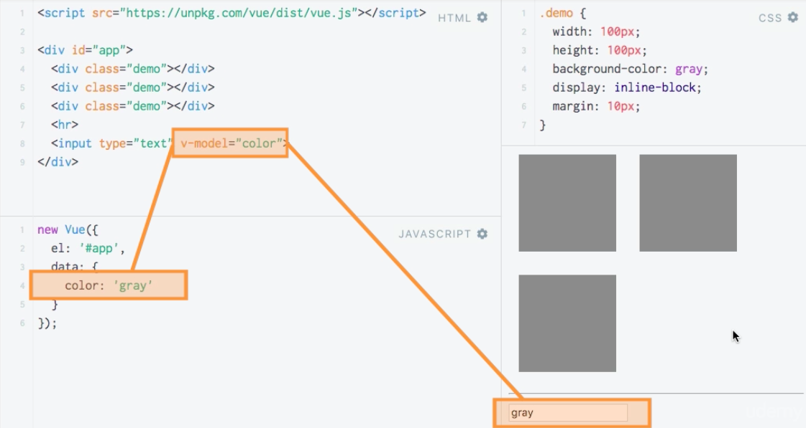

# Setting Style Dynamically : Without CSS Classes

**HTML**

```html
<script src="https://unpkg.com/vue/dist/vue.js"></script>

<div id="app">
  <div class="demo"></div>  
  <div class="demo"></div>
  <div class="demo"></div> 
  <hr>
  <input type="text" v-model="color"
</div>
```

**JS**

```js
new Vue ({
    el: '#app',
    data: {
    color: "green"  
    }
});
```

**CSS**

```css
.demo {
 width: 100px;
 height: 100px;
 background-color: grey;
 display: inline-block;
 margin: 10px;
}
.red {                      
background-color: red;
}
.green {                   
background-color: red;
}
.blue {                 
background-color: red;
}
```



Let's see how we can directly interact with the `styles` attached to an `element`. We don't have to use `classes` necessarily. Let's sey we only want to change the `style` - the color. That is as easy as bunding to `style` and then as a JS `object` the `key` is the `style` we want to bind to, and the `value` then is the `color` property in our `vue instance` `data` property. 

**HTML**

```html
<script src="https://unpkg.com/vue/dist/vue.js"></script>

<div id="app">
  <div class="demo" :style='{'background-color':'color'}'></div>  
  <div class="demo"></div>
  <div class="demo"></div> 
  <hr>
  <input type="text" v-model="color"
</div>
```

We can also setup our JS `object` in the `vue instance`. 


**JS**

```js
new Vue ({
    el: '#app',
    data: {
    color: "green"  
    },
    computed:{
        myStyle: function(){
            return {
            'background-color': this.color 
            };
        }
    }
});
```
**HTML**

```html
<script src="https://unpkg.com/vue/dist/vue.js"></script>

<div id="app">
  <div class="demo" :style='myStyle'></div>  
  <div class="demo"></div>
  <div class="demo"></div> 
  <hr>
  <input type="text" v-model="color"
</div>
```