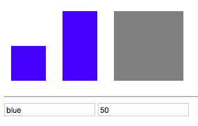

# Styling Elements with the Array Syntax

We surely can set `style` with the `array` syntax.

**HTML**

```html
<script src="https://unpkg.com/vue/dist/vue.js"></script>

<div id="app">
  <div class="demo" :style="[myStyle, {height: width + 'px' } ]"></div>  <!--array syntax-->
  <div class="demo" :style='myStyle'></div>
  <div class="demo"></div> 
  <hr>
  <input type="text" v-model="color">
   <input type="text" v-model="width">
</div>
```
**JS**
```js
new Vue ({
    el: '#app',
    data: {
    color: "green" ,
    width: 100
    },
    computed:{
        myStyle: function(){
            return {
            'background-color': this.color,
            width: this.width + 'px'
            };
        }
    }
});
```

**CSS**
```css
.demo {
 width: 100px;
 height: 100px;
 background-color: grey;
 display: inline-block;
 margin: 10px;
}
.red {                      
background-color: red;
}
.green {                   
background-color: red;
}
.blue {                   
background-color: red;
}
```

