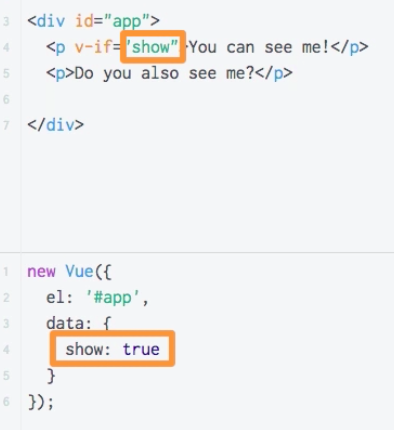
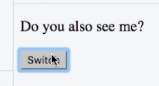
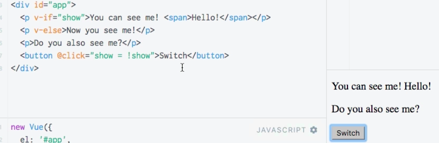

# Conditional Rendering with `v-if`

**HTML**

```html
<script src="https://unpkg.com/vue/dist/vue.js"></script>

<div id="app">
	<p>You can see me!</p>
	<p>Do you also see me?</p>
</div>
```
**JS**

```js
new Vue({
	el: '#app',
	data: {
		show: true
	}
})
```

Well, we don't want to show everiting on our `app` every time, sometimes we only want to show an `error message` or smth like that. So, we wanna conditionally show certain `messages` or `elements` on our page. VueJS includes some `methods` to allow us to easily do that. 

* `v-if` - a `directive` we can add to any `element`, and it allows us to bind it to a `condition` or to a `property` which resolves to `true` or `false`.  

**HTML**

```html
<script src="https://unpkg.com/vue/dist/vue.js"></script>

<div id="app">
	<p v-if="show">You can see me!</p> <!--use v-if-->
    <p>Do you also see me?</p>
    <button @click="show = !show">Switch</button>  <!--a button to switch-->
</div>
```





Important thing!!! If we inspect in the console the `'You can see me!'` is gone! `v-if` really attaches or detaches elements to the DOM, it not just hides them, it completely removes them. 
`v-if` can also be extended, if we use `v-else` - it will automatically refer to the latest `v-if` in front of it.  

**HTML**

```html
<script src="https://unpkg.com/vue/dist/vue.js"></script>

<div id="app">
    <p v-if="show">You can see me!</p> <!--use v-if-->
    <p v-else>Now you see me!</p>
    <p>Do you also see me?</p>
    <button @click="show = !show">Switch</button>  <!--a button to switch-->
</div>
```
Now we switch between `'Now you see me!'` and `'You can see me!'`. 
Also notice - `v-if` shows the entire `element` and all nested `elements`.



