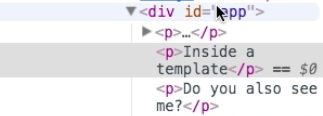

# Using Alternative `v-if` Syntax

We also have an alternative of setting up a `template` we wanna attach or remove. The `template` tag doesn't get rendered to the DOM, we won't see `template` there. 

**HTML**

```html
<script src="https://unpkg.com/vue/dist/vue.js"></script>

<div id="app">
    <p v-if="show">You can see me!</p> <!--use v-if-->
    <p v-else>Now you see me!</p>
    <template v-if="show">
    <p>Inside the Template</p>
    </template>
    <p>Do you also see me?</p>
    <button @click="show = !show">Switch</button>  <!--a button to switch-->
</div>
```
If we inspect in the console, we don't see the `template` in the DOM. 



The difference in using the `template` is that we can wrap multiple `elements` here, and group the `elements` we want to group with `v-if` (show or hide together, attach or detach together). 
