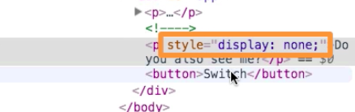

# Don't detach it with `v-show`

Speaking of `show` and `hide` - VueJS also has an option to `v-if`. `v-if` as mentioned before completely removes or adds an element from the DOM. If we wanna hide `elements` we can do this with `v-show`. It has the same syntax as `v-if`. 

**HTML**

```html
<script src="https://unpkg.com/vue/dist/vue.js"></script>

<div id="app">
    <p v-if="show">You can see me!</p> 
    <p v-else>Now you see me!</p>
    <template v-if="show">
    <p>Inside the Template</p>
    </template>
    <p v-show="show">Do you also see me?</p>   <!--use v-show-->
    <button @click="show = !show">Switch</button>  
</div>
```

Now if we switch to hide and inspect, we'll see the `paragraph` still there, but it gets the new `style=display:none`. The `element` is not detached.


 