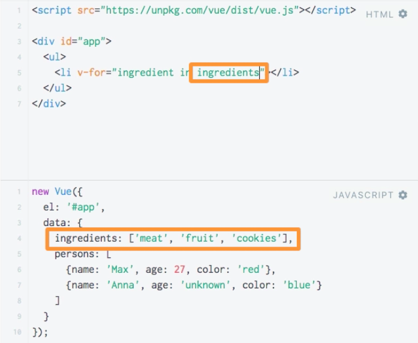
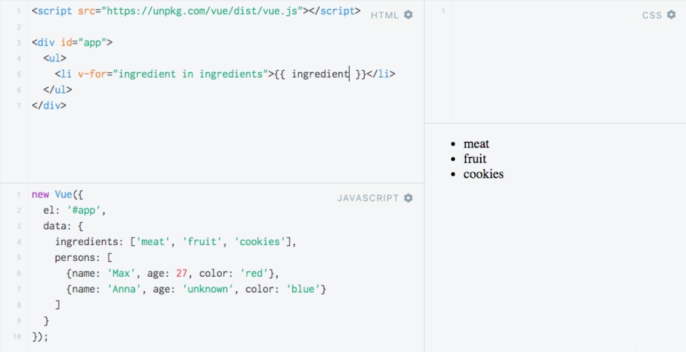

# Rendering Lists with `v-for`

**HTML**

```html
<script src="https://unpkg.com/vue/dist/vue.js"></script>

<div id="app">

</div>
```

**JS**
```js
new Vue({
	el: '#app',
  data: {
  	ingredients: ['meat', 'fruit', 'cookies'],
    persons: [
    	{ name: 'Max', age: 27, color: 'red' },
      { name: 'Anna', age: 'unknown', color: 'blue' }
    ]
  }
});
```
Imagine we wanna output the `list` of ingredients. For outputtin the `lists` like this VueJS has the `v-for` directive. It allows us to `loop` through an array and replicate the `element` on which `v-for` sits as often as needed. And in addition pull out the content in the `array` for record iteration and use it in the template. And then we can use a `variable` that VueJS creates for us during the `loop`, end for example output it. 

**NOTE** We can use this `variable` like any other `property`: we can bind to the reference of a `link` or pass it to a `function` call when listening to an `event`, etc. We can use it like any other `property` we've stored in our `vue instance`, cos VueJS creates it dymnamically for us instead. 

**HTML**

```html
<script src="https://unpkg.com/vue/dist/vue.js"></script>

<div id="app">
<ul>
<li v-for="ingredient in ingredients">{{ ingredient }}</li>   <!-- v-for directive here + output a variable -->
</ul>
</div>
```



