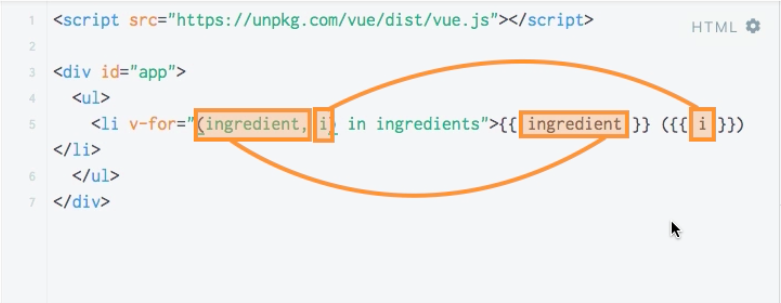

# Getting the Current Index

What if we not only want to display a `string` but also the position, the `index` of the `item` in the `list`. We wanna get access to the `index`. Let's name the `inex` - `i`. Now `i` is not defind. It is niether the `property` in our `vue instance` nor is it available through the `loop` (v-for). We can make it availabe - we can not only extract the `ingredient` - the current `item` (as we did it with `ingredient` in a loop), but also the `index` of the current `item`, by simply adding it to our `loop` with a comma. 

**HTML**

```html
<script src="https://unpkg.com/vue/dist/vue.js"></script>

<div id="app">
<ul>
<li v-for="(ingredient, i) in ingredients">{{ ingredient }} ({{i}})</li>   <!-- add an index -->
</ul>
</div>
``` 



**The order is important here!!!!** First we extract the `item` (the value of the array) and then the `index` of this `item`.


