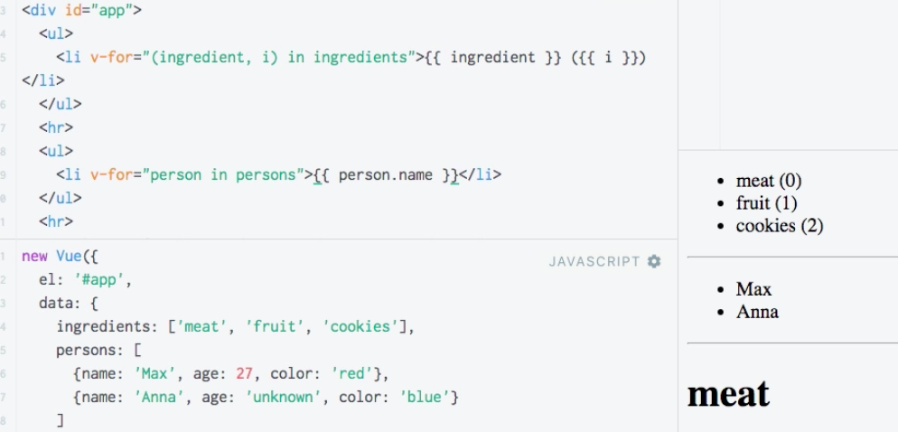
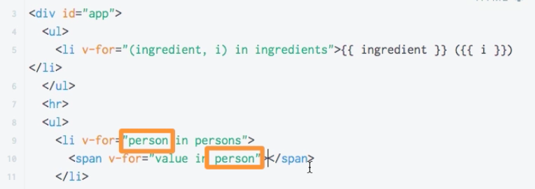
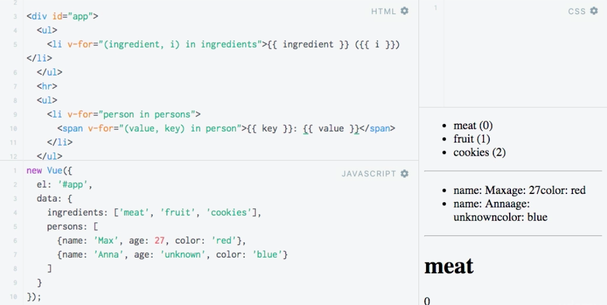
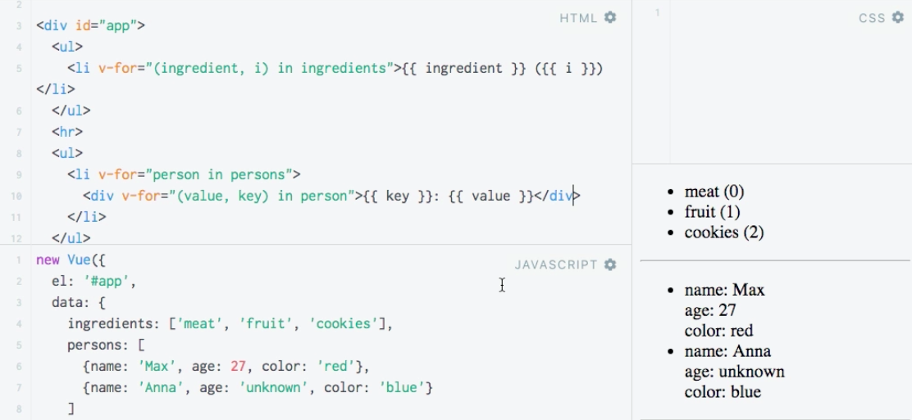

# Looping through Objects

Surely we can `loop` through `array` of `object` and through `objects` as well. Let's loop through `persons` and output `name`. 

**JS**
```js
new Vue({
	el: '#app',
  data: {
  	ingredients: ['meat', 'fruit', 'cookies'],
    persons: [
    	{ name: 'Max', age: 27, color: 'red' },
      { name: 'Anna', age: 'unknown', color: 'blue' }
    ]
  }
});
```

**HTML**

```html
<script src="https://unpkg.com/vue/dist/vue.js"></script>

<div id="app">
<ul>
<li v-for="(ingredient, i) in ingredients">{{ ingredient }} ({{i}})</li>   
</ul>
<hr>
<ul>
  <li v-for="person in persons">{{person.name}}</li>                   <!-- loop through object and  output name -->
</ul>
<hr>
<templete v-for="(ingredient, index) in ingredients">  
<h1>{{ingredient}}</h1>
<p>{{index}}</p>
</template>
</div>
``` 



Let's say we don't want to use a default `loop` but instead we wanna `loop` through all the `key value` pairs in that `object`. In this case we can `loop` as simple as extracting the `value` in `person`. 

**HTML**

```html
<script src="https://unpkg.com/vue/dist/vue.js"></script>

<div id="app">
<ul>
<li v-for="(ingredient, i) in ingredients">{{ ingredient }} ({{i}})</li>   
</ul>
<hr>
<ul>
  <li v-for="person in persons">{{person.name}}
      <span v-for="value in person">{{value}}</span>  <!--nested loop-->
  </li>                  
</ul>
<hr>
<templete v-for="(ingredient, index) in ingredients">  
<h1>{{ingredient}}</h1>
<p>{{index}}</p>
</template>
</div>
``` 



As with `arrays` and `index` - for `looping` through `objects` we can also get the `key`. As with `arrays` the ordering here is important!

**HTML**

```html
<script src="https://unpkg.com/vue/dist/vue.js"></script>

<div id="app">
<ul>
<li v-for="(ingredient, i) in ingredients">{{ ingredient }} ({{ i }})</li>   
</ul>
<hr>
<ul>
  <li v-for="person in persons">{{person.name}}
      <span v-for="(value, key) in person">{{ key }} : {{ value }}</span>  <!--get the key-->
  </li>                  
</ul>
<hr>
<templete v-for="(ingredient, index) in ingredients">  
<h1>{{ ingredient }}</h1>
<p>{{ index }}</p>
</template>
</div>
``` 



If we change the `span` to the `div`, we'll see it much clearer. 

**HTML**

```html
<script src="https://unpkg.com/vue/dist/vue.js"></script>

<div id="app">
<ul>
<li v-for="(ingredient, i) in ingredients">{{ ingredient }} ({{ i }})</li>   
</ul>
<hr>
<ul>
  <li v-for="person in persons">{{person.name}}
      <div v-for="(value, key) in person">{{ key }} : {{ value }}</div>   <!--change span to the div-->
  </li>                  
</ul>
<hr>
<template v-for="(ingredient, index) in ingredients">  
<h1>{{ ingredient }}</h1>
<p>{{ index }}</p>
</template>
</div>
``` 



Finally, if we also wanna get the `number` of the iteration, we can access the `index` by passing the third kind of `'argument'` in the `loop`. 

**HTML**

```html
<script src="https://unpkg.com/vue/dist/vue.js"></script>

<div id="app">
<ul>
<li v-for="(ingredient, i) in ingredients">{{ ingredient }} ({{ i }})</li>   
</ul>
<hr>
<ul>
  <li v-for="person in persons">{{person.name}}
    <div v-for="(value, key, index) in person">{{ key }} : {{ value }} ({{ index }})</div>  <!--pass an index          'argument'-->
  </li>                  
</ul>
<hr>
<template v-for="(ingredient, index) in ingredients">  
<h1>{{ ingredient }}</h1>
<p>{{ index }}</p>
</template>
</div>
``` 

