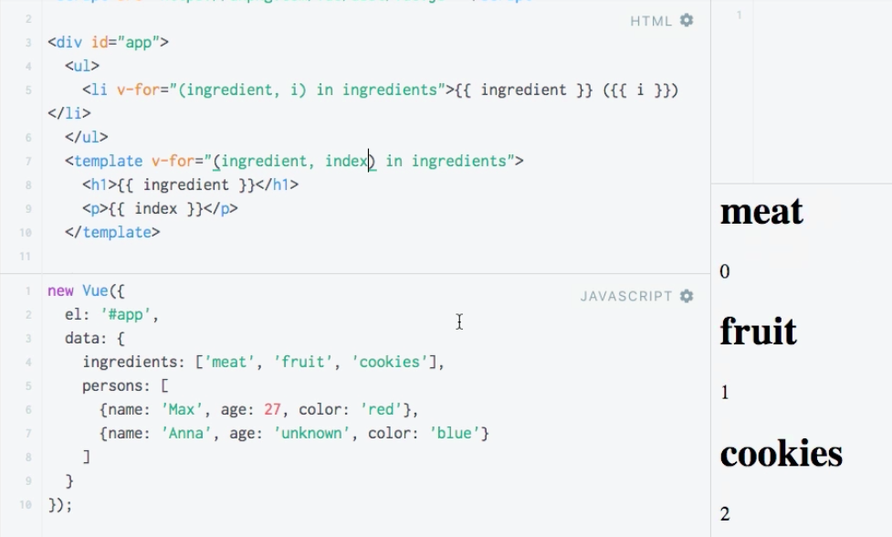

# Using an Alternative `v-for` Syntax

What if we don't want to output the `list` but wanna output a `heading` where we output the `ingredient` name, followed by a `paragraph` where we output the `index`. Well, we can `loop` using the `template`. 

**HTML**

```html
<script src="https://unpkg.com/vue/dist/vue.js"></script>

<div id="app">
<ul>
<li v-for="(ingredient, i) in ingredients">{{ ingredient }} ({{i}})</li>   
</ul>
<templete v-for="(ingredient, index) in ingredients">  <!-- loop with a template -->
<h1>{{ingredient}}</h1>
<p>{{index}}</p>
</template>
</div>
``` 



