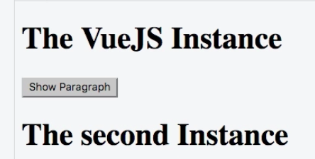

# Using Multiple Vue Instances

### Example

Let's say we have two `divs` 

**HTML**

```html
<script src="https://unpkg.com/vue/dist/vue.js"></script>

<div id="app1">
  <h1 ref="heading">{{ title }}</h1>
  <button v-on:click="show">Show Paragraph</button>
  <p v-if="showParagraph">This is not always visible</p>
</div>

<div id="app2">
  <h1 ref="heading">{{ title }}</h1>
  <button v-on:click="show">Show Paragraph</button>
  <p v-if="showParagraph">This is not always visible</p>
</div>
```

Now in our JS file we can just create a new `vue instance`, and bind the `el` with the `#app2` `div`.

**JS**

```js
new Vue({
  el: '#app2',
  data: {
    title: 'The VueJS Instance',
    showParagraph: false
  },
  methods: {
    show: function() {
      this.showParagraph = true;
      this.updateTitle('The VueJS Instance (Updated)');
    },
    updateTitle: function(title) {
      this.title = title;
    }
  },
  computed: {
    lowercaseTitle: function() {
      return this.title.toLowerCase();
    }
  },
  watch: {
    title: function(value) {
      alert('Title changed, new value: ' + value);
    }
  }
});

new Vue({
  el: '#app2',
  data: {
    title: 'The Second Instance',
  }, 
});
```



Be aware though, that we can acess the `properties` only of that specific `instance` they live in. 