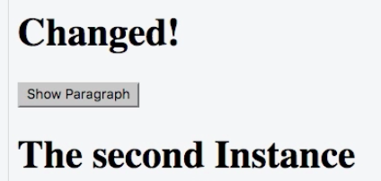

# Accessing the Vue Instance from Outside

Well, we always use `new Vue`, we areate a new `vue instance` and we don't store it in a `variable`. It is still created and managed for us, this `instance` exists, but it's not stored in a `variable`. 
Well, we can do so. We can name it `vm` - as it stands for `vue model` (surely, we can give it any name we want).

**JS**

```js
var vm1 = new Vue({
  el: '#app2',
  data: {
    title: 'The VueJS Instance',
    showParagraph: false
  },
  methods: {
    show: function() {
      this.showParagraph = true;
      this.updateTitle('The VueJS Instance (Updated)');
    },
    updateTitle: function(title) {
      this.title = title;
    }
  },
  computed: {
    lowercaseTitle: function() {
      return this.title.toLowerCase();
    }
  },
  watch: {
    title: function(value) {
      alert('Title changed, new value: ' + value);
    }
  }
});

var vm2 = new Vue({
  el: '#app2',
  data: {
    title: 'The Second Instance',
  }, 
  methods: {
      onChange: function(){
        vm1.title = 'Changed!';
      }
  }
});
```

Now we can add in our second instance a new `button`. 

**HTML**

```html
<script src="https://unpkg.com/vue/dist/vue.js"></script>

<div id="app1">
  <h1 ref="heading">{{ title }}</h1>
  <button v-on:click="show">Show Paragraph</button>
  <p v-if="showParagraph">This is not always visible</p>
</div>

<div id="app2">
  <h1 ref="heading">{{ title }}</h1>
  <button v-on:click="onChange">Change something in Vue 1</button>
</div>
```

And add in JS `onChange` method. Inside this `function` we wanna make the `title` of the first `vue instance` change. 

```js
methods: {
      onChange: function(){
        vm1.title = 'Changed!';
      }
```


So, we are able to access one `instance` from another. We can do this also form a normal JS code between the two `instances`. 

Notice, that VueJS also proxies the `properties` we setup in the `data` and it does the same for our `methods` and `computed` properties. It proxies them, so that we can easily access them like this: `vm1.title`. Tehnically `vm1` is a `vue instance`. 