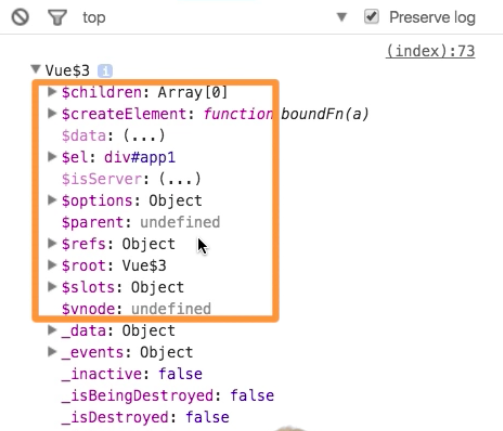
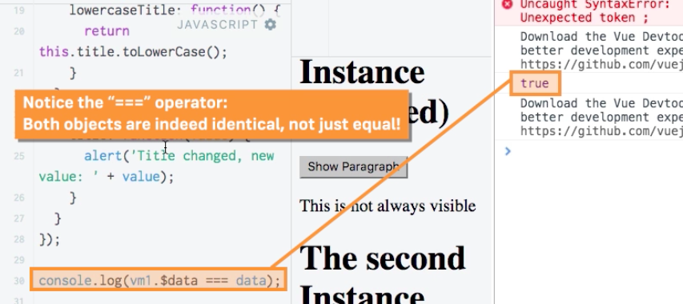

# Closer look at `$l` and `$data`

If we inspect a `vue instance` we see a couple of `properties`, which clearly were not created by us. These are actually the `properties` that we can use. 

 

* `$el` - referes to our `template`, to our `html` code of that `instance`.  This is how VueJS keeps track of what our `html` code is. 

* `$data` - is an `object` which holds our `data` properties. This is another way of accessing the data from outside. 

**JS**

```js
var vm1 = new Vue({
  el: '#app2',
  data: {
    title: 'The VueJS Instance',
    showParagraph: false
  },
  
  computed: {
    lowercaseTitle: function() {
      return this.title.toLowerCase();
    }
  },
  
});

console.log(vm1.$data.title)  // get from outside 

var vm2 = new Vue({
  el: '#app2',
  data: {
    title: 'The Second Instance',
  }, 
  methods: {
      onChange: function(){
        vm1.title = 'Changed!';
      }
  }
});
```

This is another way how we cat initialise the `data` in our instances. We don't have to write everything in `vue instance` object, we can also create the `data` variable before creating the `vue instance` and then simply pass it as a value for `key-value pair` in the `vue instance`. 

**JS**

```js
var data = {                   // create the `data` variable before
    title: 'The VueJS Instance',
    showParagraph: false}

var vm1 = new Vue({
  el: '#app2',
  data: data,    // pass data as a value
  methods: {
    show: function() {
      this.showParagraph = true;
      this.updateTitle('The VueJS Instance (Updated)');
    }
```



Of course we wanna be sure that we don't mess that are uder conrtole of VueJS. So, if we controle a part of `html` code with VueJS, we probably don't want to acess it JS code too, cos we could mess up the reactivity of VueJS. But generally it is normal to mix JS code and VueJS. 