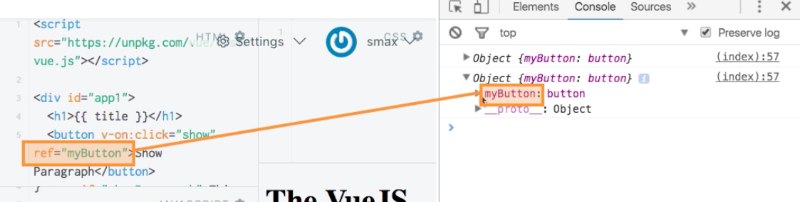

# Placing `$refs` and Using them in the Template

If in our `html` code we wanna get the current content of a `button` for example. We can place a `ref` key on it. `ref` is a key which is recognised by VueJS on any `element`. And we can set equal to any name we like. 

*HTML**

```html
<script src="https://unpkg.com/vue/dist/vue.js"></script>

<div id="app1">
  <h1 ref="heading">{{ title }}</h1>
  <button v-on:click="show" ref="myButton">Show Paragraph</button> <!--add ref-->
  <p v-if="showParagraph">This is not always visible</p>
</div>

<div id="app2">
  <h1 ref="heading">{{ title }}</h1>
  <button v-on:click="onChange">Change something in Vue 1</button>
</div>
```

Inside of the `vue istance` we have access to all the `refs` we registered with the `ref` key  with `$refs` property. Let's say when we execute `show` function, we wanna conlole.log this `ref` attribute, so we learn more about it. 

**JS**

```js
var vm1 = new Vue({
  el: '#app2',
  data: {
    title: 'The VueJS Instance',
    showParagraph: false
  },
  methods: {
    show: function() {
      this.showParagraph = true;
      this.updateTitle('The VueJS Instance (Updated)');
      console.log(this.$refs)                                   // console log ref
    },
    updateTitle: function(title) {
      this.title = title;
    }
  },
  computed: {
    lowercaseTitle: function() {
      return this.title.toLowerCase();
    }
  },
  watch: {
    title: function(value) {
      alert('Title changed, new value: ' + value);
    }
  }
});

var vm2 = new Vue({
  el: '#app2',
  data: {
    title: 'The Second Instance',
  }, 
  methods: {
      onChange: function(){
        vm1.title = 'Changed!';
      }
  }
});
```



On these `refs` we can use all `refs` we registered, using the name we setup as a `property`. This way we can rename our `button` to "Test" and not "Show paragraph" as it was before. 

**JS**

```js
var vm1 = new Vue({
  el: '#app2',
  data: {
    title: 'The VueJS Instance',
    showParagraph: false
  },
  methods: {
    show: function() {
      this.showParagraph = true;
      this.updateTitle('The VueJS Instance (Updated)');
      this.$refs.myButton.innerText = "Test"                  // console log ref using a name of the ref
    },
    updateTitle: function(title) {
      this.title = title;
    }
  },
  computed: {
    lowercaseTitle: function() {
      return this.title.toLowerCase();
    }
  },
  watch: {
    title: function(value) {
      alert('Title changed, new value: ' + value);
    }
  }
});

var vm2 = new Vue({
  el: '#app2',
  data: {
    title: 'The Second Instance',
  }, 
  methods: {
      onChange: function(){
        vm1.title = 'Changed!';
      }
  }
});
```


BUT be aware if we change something with `ref` - this is not reactive, this is not part of `vue instance`, this is directly in the DOM, so our changes may be overridden. It may be convenient to use a `ref` though if you want to get some `value`, if we need to access a native `element`. 

To deep dive use - [vuejs.org/api](https://vuejs.org/v2/api/)
   