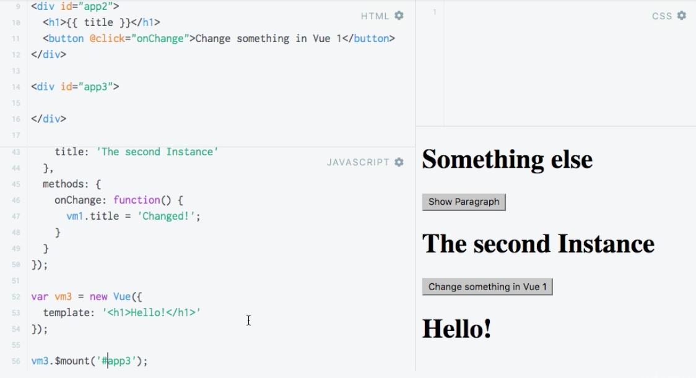

# Mounting a Template

`$mount()` is a `method` which allows us to do the same as the `el` property.

### Example

We can remove the `el` property from the `vue instance` and in the JS code, ouside the `vue instance` using `$mount()` method pass the CSS selector at the place we wanna mount the app at. 

*HTML**

```html
<script src="https://unpkg.com/vue/dist/vue.js"></script>

<div id="app1">
  <h1 ref="heading">{{ title }}</h1>
  <button v-on:click="show" ref="myButton">Show Paragraph</button> <!--add ref-->
  <p v-if="showParagraph">This is not always visible</p>
</div>

<div id="app2">
  <h1 ref="heading">{{ title }}</h1>
  <button v-on:click="onChange">Change something in Vue 1</button>
</div>
```

**JS**

```js
var vm1 = new Vue({
                                      // no el property here
  data: {
    title: 'The VueJS Instance',
    showParagraph: false
  },
  methods: {
    show: function() {
      this.showParagraph = true;
      this.updateTitle('The VueJS Instance (Updated)');
      this.$refs.myButton.innerText = "Test"                 
    },
    updateTitle: function(title) {
      this.title = title;
    }
  },
  computed: {
    lowercaseTitle: function() {
      return this.title.toLowerCase();
    }
  },
  watch: {
    title: function(value) {
      alert('Title changed, new value: ' + value);
    }
  }
});

vm1.$mount("#app1")   // using mount method
```
The `el` propperty makes it easier for us, if we know where to mount it  - use the `el` property. But there might be a use case where we wanna to configure and setup our `vue instance`, but we don't know yet where to mount it, or the `object`, the html `element` where we wanna to mount it doesn't exist yet. In such a case we could create it, execute some other code, and once we know where to mount it, we can call the `variable` name where we store out `vue instance` then `$mount()` and as an `argument` pass the selector leading to the `element` where we do want to mount it. 

There is one more we can do. We can create e.g a new `div` which contains nothing. 

**HTML**

```html
<script src="https://unpkg.com/vue/dist/vue.js"></script>

<div id="app1">
  <h1 ref="heading">{{ title }}</h1>
  <button v-on:click="show" ref="myButton">Show Paragraph</button> <!--add ref-->
  <p v-if="showParagraph">This is not always visible</p>
</div>

<div id="app2">
  <h1 ref="heading">{{ title }}</h1>
  <button v-on:click="onChange">Change something in Vue 1</button>
</div>

<div id='app3'>     <!--new div here-->
 

</div>
```

And a new `vue instance`. And use a property `template` as a string. So, we created a `vue instance` with our own Template. It's now not deriving it from our code, cos we don't setup the `el` element. Now we can use the `mount()` method, as we'll see the `heading` "Hello". 

**JS**

```js
var vm1 = new Vue({
                                      
  data: {
    title: 'The VueJS Instance',
    showParagraph: false
  },
  methods: {
    show: function() {
      this.showParagraph = true;
      this.updateTitle('The VueJS Instance (Updated)');
      this.$refs.myButton.innerText = "Test"                 
    },
    updateTitle: function(title) {
      this.title = title;
    }
  },
  computed: {
    lowercaseTitle: function() {
      return this.title.toLowerCase();
    }
  },
  watch: {
    title: function(value) {
      alert('Title changed, new value: ' + value);
    }
  }
});

vm1.$mount("#app1")   

var vm3 = new Vue({       //new Vue here 
template: '<h1>Hello!</h1>'
});

vm3.$mount('#app3')   //mount it
```



We also can call `$mount()` with no `argument`. And this would create it offscreen. We could now call `getElementByID` and append our `vm3` variable and the `$el` property. 

**JS**

```js
var vm3 = new Vue({       
template: '<h1>Hello!</h1>'
});

vm3.$mount();
document.getElementById( 'app3' ).appendChild( vm3.$el )

```

So, we created the `instance` offscreen, it has it's own `template`, so it doesn't need anything else than that, and  then we can append it somewhere in the html code and pass the `$el` property, which happens to keep our template in the `vue instance`. 