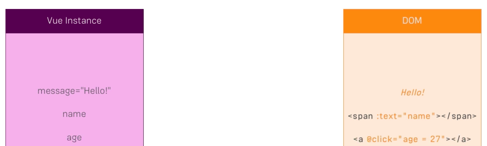
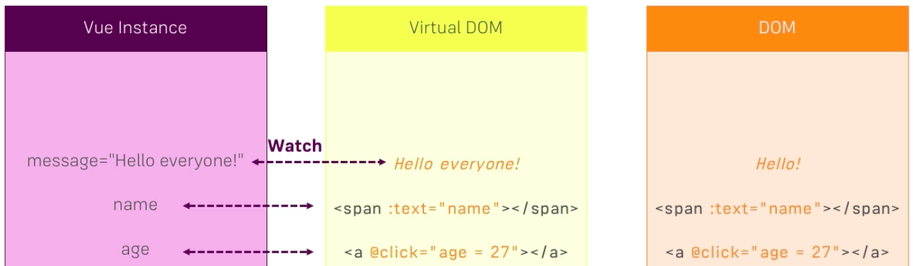
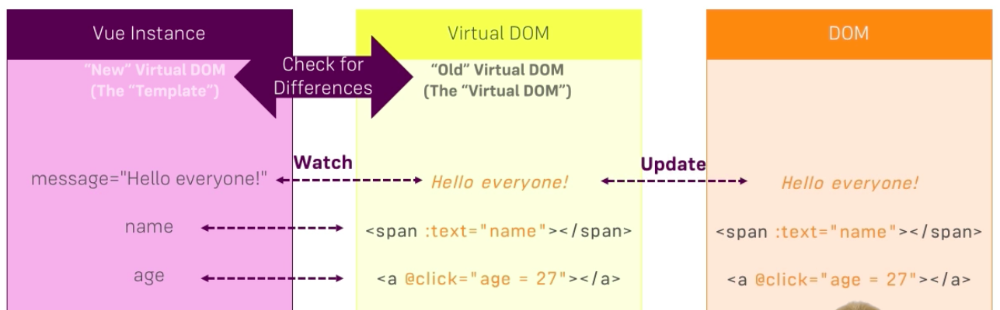

# How VueJS updates the DOM

We know that `vue instance` creates and holds a `template`, either derived from `html` code or passed with this `template` property. In this `template` we might have a message where we say "Hello", and this of course also represented in the DOM after this has been rendered. And we might have other `properties` used in the DOM or used in our `template` , but then finally being printed to the DOM. 

What if we change the message? Each `propery` that we have, has its own `watcher`. VueJS when we pass an `object` to the constructor creates these `watches` for all our `properties` in our `data` property. That allow us to watch the changes to these `properties`, which means it needs to update smth. BUT it's not constantly updating it in the real DOM just because it changed. 

If we change a message and set it to "Hello" again, than technically we touched this `property`, we changed it, but we changed it at the same `value` as before. It would rerender the part of the DOM or worst of all a complete DOM  - and that would be a real performance hit, cos accessing the real DOM is the part which takes the most performance. 

JS is very fast, but the accessing the DOM is super slow. So we need to do this as seldom as possible. And this is not what it does, neither for message nor for the other `properties`. Insetead it has an extra layer - the virtual DOM. 

And on the `virtual DOM` this is a representation of a real DOM, kind of a copy, but a copy parsed in JS and there to be very quick to be accessed. VueJS wathes these changes, writes them to the `virtual DOM`, and then it takes the difference between the `template` and the `virtual DOM` and only updates this part (the part we changed) in the real DOM. 

So, it knows which `property` changed, which part of the `template` it affected, what is the current state of the DOM, represented by the `virtual DOM` - and now it goes to the rela DOM. And since it also updated the `virtual DOM` it automatically got the up-to-date representation of the real DOM without having to take a full copy of that again. 