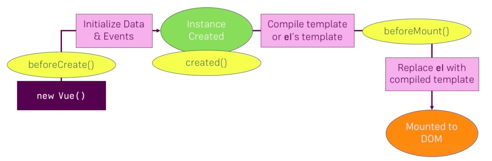

# The VueJS Instance Lifecycle

Let's look what happens behind the scenes. 

The VueJS Instance Lifecycle starts with the `new Vue ()` constructor. There than we first execute the life cycle `method`,to which we can listen to  - `beforeCreate()`.  After it, it initializes the `data` and `events` we pass to the `object` in the `vue instance` and then it created the `instance` and calls the `created()\` life cycle hook `method`, to which we can also listen to. Thereafter it compiles the `template` or it derives the `template` from our html code, if we use `el` or `mount`. So, it either uses the `template` provided with the `template property` or derives it.

Then `beforeMount()` method is reached. This is called right before this `template`, which is rendered, is mounted to the real DOM, so, it's not there yet. Now we replace the `el` in `vue instance` with with the `compiled template`. It's still not mounted, but now VueJS compiled the `template`, inserted all the `values` for the `string interpolation`, set up all the bindings, so converted it to the real `html` code so to say, but still behind the scenes. 

Now we mount it to the DOM. So, we take the compiled `template`, which is exactly the html code we'll see in the DOM, and writes it to the DOM. Now our `vue instance` is hooked up to the DOM and can be seen there. 

We got ongoing life cycle, which we can tab multiple times, which is if some `data` changes  and the DOM is re-rendered. Here we have the `beforeUpdate()` life cycle hook, right before we re-render the DOM. So, after we saw that the `data` changed but before the DOM is re-rendered. And then the `updated()` lifecycle, which is obviously after this part in the DOM was updated. We also got the `beforeDestroy()` lifecycle right before the `instance` is destroyed. And it then ends with the `destroyed` lifecycle hook, which we can tab right after the `instance` was destroyed. 

All these `methods` here can be used to execute some code in the different phases of the lifecycle. 

