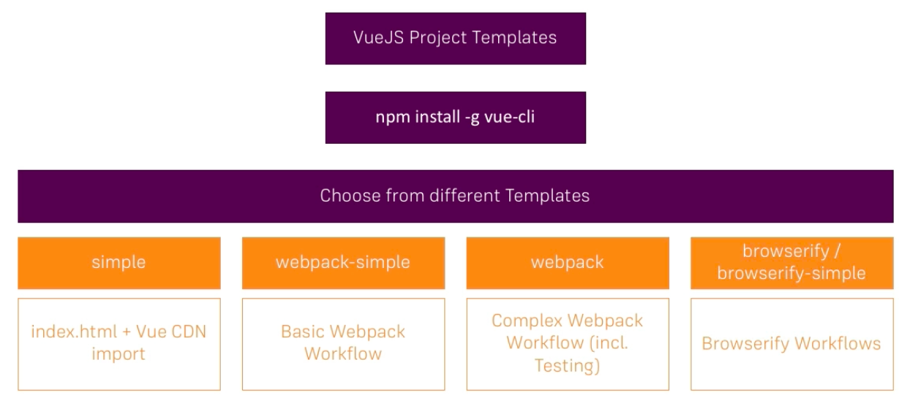

# Using the Vue CLI to create projects

We could setup a `workflow` on our own, we could use `webpack` and there we have the Vue loader to safe that right away, which is a package allowing us for example to transform such `single file` templates.

But here we will use `Vue CLI`. `Vue CLI` has one major task. It allows us to fetch VueJS Project Templates, which means to fetch certain project setups, which are empty, but which have a build up process setup. We can install the `Vue CLI` with the command `npm install -g vue-cli`. It installs globally on our machine, and then we have access to a multitude of available `templates`. 

