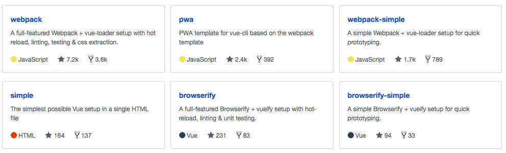
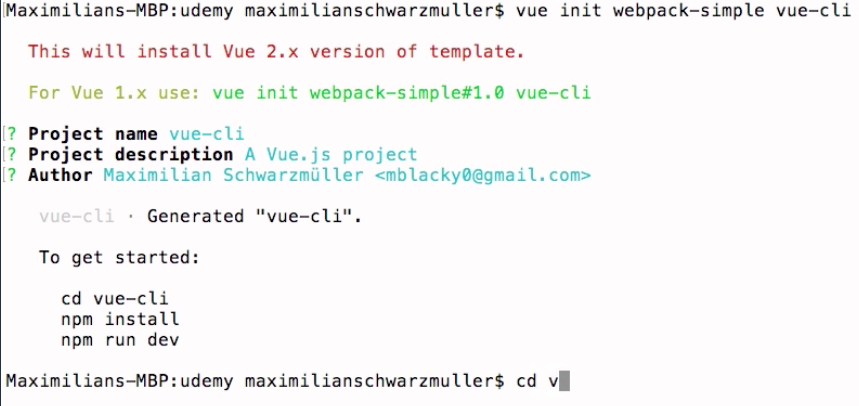

# Installing the Vue CLI and Creating a new Project

`npm` is the node package meneger, so for this to work we would need to install `nodeJS`. We download the latest version  from [nodejs.org](https://nodejs.org/en/), install it.

* In the terminal we write `$sudo npm install -g vue-cli`.

`npm` - is the `node packege manager`. So, for this to work we need to install `nodeJS`.  We will need  this for the node package meneger, which is the defacto tool to use for frontend development, to manage your dependances, and also cos the development server, which will be included in the template we are using, it will still need `nodeJs` to run. 
* after entering `enter` we'll have to enter our password, and that will pull down and install `cli` on your machine. 

* after the installation is finished we can navigate into a folder where we wanna store our project. And we can do this simply writing
`vue`. Then we write `init` to initialize a new project, and then which `template` we wanna use, and then the project folder we wanna create. 

`vue init webpack-simple vue-cli`

*  we hit enter and this will setup this project. We can confirm the default project name, project description, our name and then we are done and need to follow the commands. 

* first command: cd vue-cli
* second: npm install - to pull down all the dependances it needs, cos it's just created the `template` with the `package.json`. `package.json` is our dependancies management file. In this file all the dependancies of this project are listed. All development dependancies. 
* third: npm run dev - this will start the development server we can use, and it will keep running, will automatically recompile everything and reload our server automatically whenever we change our file. 
