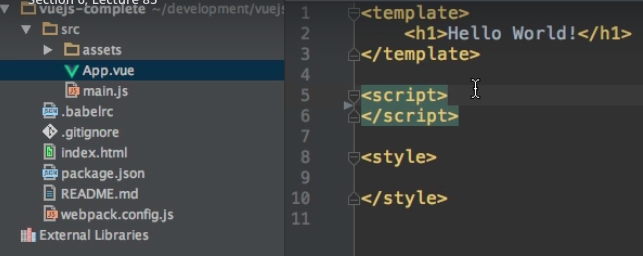

# Understanding the `Object` in the Vue File

The important thing here is that whenever we export in the App.vue the `object` - it is the same `object` we use ina `vue instance`. We can use this as a `componenet`. We can use it in `main.js` file with a `render` function. It is used as the `vue instance` and therefore it has the same `properties`: we can setup `methods`, `computed`. The key point here  - the `export default {}` object in the `App.vue` file works the same as the `vue instance`. 

**Side note:** we don't have to export , we can delete it from the file and it still will work, cos the ` is not required.

 

It is required if we wanna attach some business logic to the `template`, if for example we wanna use `string interpolation` then in this `object` we will setup the `data` field with the `data` properties we wanna interpolate and so on. 