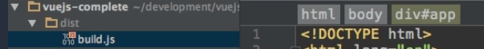

# How to build your App for Production
`npm run build` - buld your app for production which actually means it creates a `dist` folder.
This is how we use this command if we actually wanna deploy our app. 

