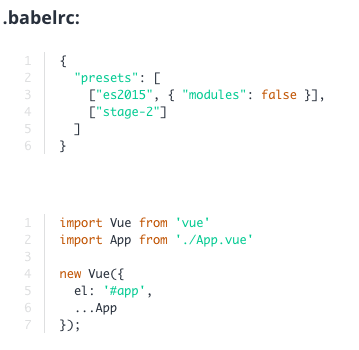
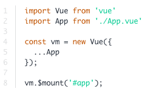

# More about `.vue` files and CLI

### The ".vue" File

* You can learn more about `".vue"` Files in this Article from the [official Docs](http://vuejs.org/guide/single-file-components.html)

* Learn more about the `render()`  method in another Article in the [official Docs](http://vuejs.org/guide/render-function.html)

* Finally, it's important to be aware of the fact, that you can also load your `App.vue File` (your main Component/ Instance) via the following two Ways (Alternatives to `render()` ):

1. Using the `ES6 Spread Operator` (for that, you need to add babel-preset-stage-2 as a Dependency and to your `.babelrc File)`:

`npm install --save-dev babel-preset-stage-2`

2. Using `mount()` :

Also install the stage-2 preset as described above.

### The CLI

* Learn more about the CLI [here](https://github.com/vuejs/vue-cli)

**Local CSS / Sass Files and CLI Templates**

* The `webpack-simple` template doesn't support `local CSS or Sass files`, because no CSS loader is set up.

Use the `webpack template` (not webpack-simple) to get this [functionality](https://github.com/vuejs-templates/webpack)

