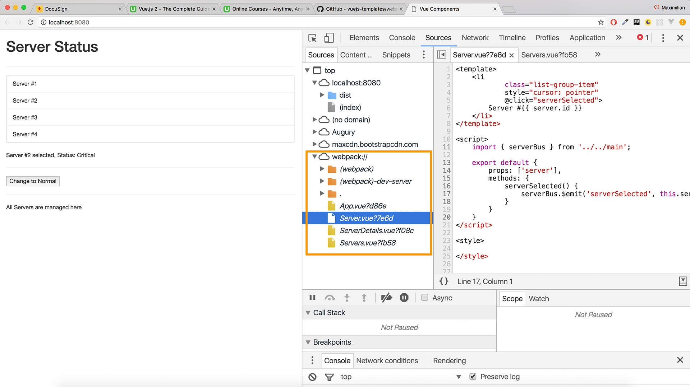

# Debugging VueJS Projects

**There are two main Tools you may use:**

1. The Developer Tools in Chrome (see below)

2. The [Vue Developer Tools](https://github.com/vuejs/vue-devtools)

When working with a Project created by the **CLI** (using Webpack!), you can easily debug your running Application by opening your **Developer Tools** (see below in Chrome) and going to **"Sources"** there. 

You should see a `"Webpack"` folder which you may open to see **all your files** included in the project (see image below, in orange box).

You can open any file there and **set breakpoints etc.** to debug your running application.

