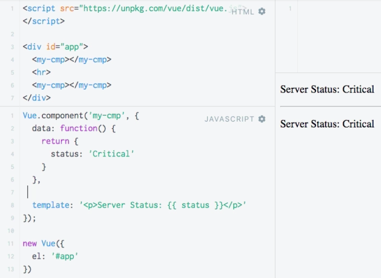

# Introduction

**HTML**
```html
<script src="https://unpkg.com/vue/dist/vue.js">
</script>

<div id="app">

</div>
```

**JS**
```js
new Vue ({
    el: '#app',
    data: {
    status: 'Critical'
    },
    template: '<p>Server Status: {{status}} </p>'
})
```
Let's say we wanna place this 'Server status' in various places in the app. As we know it's not that easy to do. If we repeat this, we will  see it printed ONLY once. 

**HTML**
```html
<script src="https://unpkg.com/vue/dist/vue.js">
</script>

<div id="app">

</div>
<hr>
<div id="app">  <!--repeat here-->

</div>
```

**JS**
```js
new Vue ({
    el: '#app',
    data: {
    status: 'Critical'
    },
    template: '<p>Server Status: {{status}} </p>'
})
```


That is because we are creating a `vue instance` here, and with that `instance` we will only select the first `element`. 

If we wanna repeat the `element` in many places of our app, we need to use a `component` - a reusable piece of our `vue instance`. A `component` basically extends the `vue instance`. We can create a `component` by using g vue `object` and then running the `component` method on that. Behind the scenes it will give us a kind of new `instance` but with some extra features. 

**HTML**
```html
<script src="https://unpkg.com/vue/dist/vue.js">
</script>

<div id="app">

</div>
```

**JS**
```js
Vue.component();     //new component

new Vue ({
    el: '#app',
    data: {
    status: 'Critical'
    },
    template: '<p>Server Status: {{status}} </p>'
})
```

The first `argument` in the `vue component` is the `tag name` which you wanna use to enter the `component`. We can think of the `component` as our own `html element` we are creating. E.G. we use a tag name - `my-cmp`. This will allow us to enter `<my-cmp></my-cmp>` in the html code - so creating our own html `element` which. **Make sure** to add a prefex to make your compomemt unique, so that you don't interfere with any third-party packages you might use, or existing or possible future html `elements`. The second `argument` is the actual `object` which represents our `component`. And this is generally is the same `object` as we pass in our `vue instance`. **NOTE** The `data object` in the `component` must be a `function`, whare we then return a new `object`, holding the data. By wrapping it in a `function` we make sure we are not interfereng with our data. 

**HTML**
```html
<script src="https://unpkg.com/vue/dist/vue.js">
</script>

<div id="app">
<my-cmp></my-cmp>
<hr>
<my-cmp></my-cmp>
</div>
```

**JS**
```js
Vue.component('my-cmp'
{
data: fucntion(){
return {
    status: 'Critical'
}
}
template: '<p>Server Status: {{status}} </p>'
});     

new Vue ({
    el: '#app',
    
})
```

