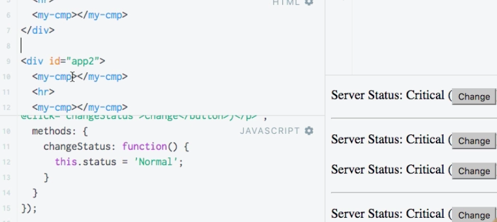
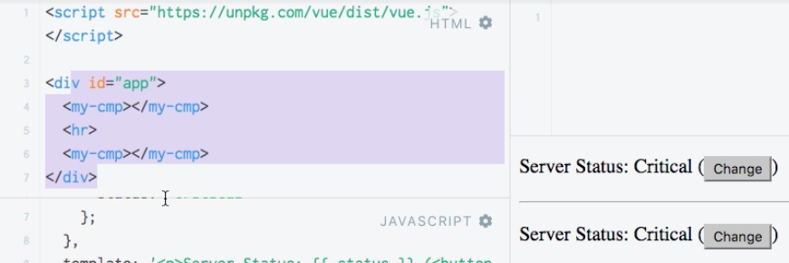

# Registering  Components Locally and Globally

In case we create a second app - we create a new `vue instance` too.  

**HTML**
```html
<script src="https://unpkg.com/vue/dist/vue.js">
</script>

<div id="app">
<my-cmp></my-cmp>
<hr>
<my-cmp></my-cmp>
</div>

<div id="app2">   <!--new app-->
<my-cmp></my-cmp>
<hr>
<my-cmp></my-cmp>
</div>
```

**JS**
```js
Vue.component('my-cmp'
{
data: fucntion(){
return {
    status: 'Critical'
}
}
template: '<p>Server Status: {{status}} </p>'
});     

new Vue ({
    el: '#app',
    
})

new Vue ({             //second vue instance
    el: '#app2',
    
})
```


What if we wannan to register `components` globally and locally. We wanna use the same `selector`, maybe, but use different `components` in the end. To do this we don't call a `vue component` which registeres it globally. Instead we will store it as a `variable`. In our `vue instance` we can add a new `components` property, which basically tells this `instance` which locall `components` we have. So, `components` only usable in this particular `instance`. In the `components property` we setup our selector and it will refer to our `component variable` data. Then we setup local `component`.  

**JS**
```js
var cmp =
{
data: fucntion(){
return {
    status: 'Critical'
}
}
template: '<p>Server Status: {{status}} </p>'
};     

new Vue ({
    el: '#app',
    components: {
        'my-cmp': cmp 
    }
    
})

new Vue ({             //second vue instance
    el: '#app2',
    
})
```

Now we have the `component` only for the first up, cos for the second it was not registered. 



We surely can register it globally, using `Vue.component({})`.