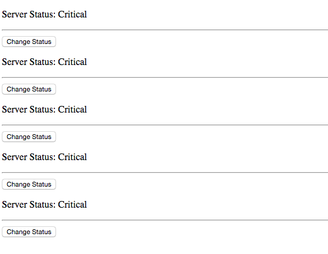
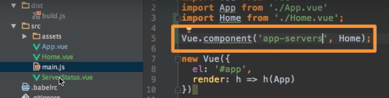
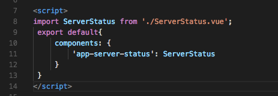

# Using Components

Let's imagine our application managing the status of several servers and we wanna be able to track the status of each server and change it. 
Actually, we need to loop through all the servers we got. For this we need a `for` loop and also we need access to the server status `component`. First we create a new `component` file and name it `ServerStatus`. And let's gerister it here locally. In the `Home.vue` file we add the `components` method, and here we setup a `key` as a string, and we wanna refer to the `component` in the `ServerStatus.vue` file. For this we need to import it here. And assign the `object` of the `component` to the slector. And now we can use <app-server-status> in our template. Now we can loop through several servers, by saying `v-for='server in 5'` to loop throught `0` to `5`. 

#### In our `Home.vue` file 

```html
<template>
<div>
<app-server-status v-for></app-server-status>     <!--loop here-->
</div>
</template> 

<script>
import ServerStatus from ./ServerStatus.vue;    //import here 
 export default{
     components:{                          //register locally
         'app-server-status': ServerStatus
     }
 }
</script>

<style></style>
```
#### In our ServerStatus file

```html
<template>
<div>
<p>Server Status: {{status}}</p>
<hr>
<button @click="changeStatus">Change Status</button>
</div>
</template> 

<script>
 export default{
     data: function(){
      return {
          status: 'Critical'
      }   
     },
     methods: {
         changeStatus (){
             this.status = 'Normal';
         }
     }
 }
</script>

<style></style>
```
### Result 

We'll have all 5 servers



So, now we are using both: `global` component



and a `local` component


