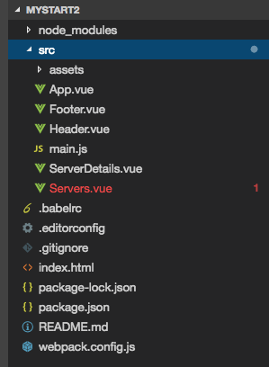
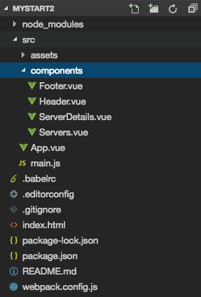

# Better Folder Structure



Well,  having all the `components` files together in the project folder, makes it crouded and hard to manage. Therefore we can create a sub-directory from our project folder and name it `components` for example.  



And of cource we need to adjust out imports in the `App.vue` file then an dlink to `components` folder. 

```html
<script>
import Header from './components/Header.vue';  //link to components
import Servers from './components/Servers.vue';
import ServerDetails from './components/ServerDetails.vue';
import Footer from './components/Footer.vue'

export default{
  components: {
  'app-header' : Header,
  'app-servers': Servers,
  'app-server-details': ServerDetails,
  'app-footer': Footer
  }
}
</script>
```

This is one possible format, which is great for small to medium sized `applications`. For bigger applications, we probably wanna to structure our folders by feature. This case we wouldn't have `components` folder, instead we would have let's say a shared folder for `header and footer`, which are shared across multiple features maybe. And then a `servers` folder for our server related `components`. 

