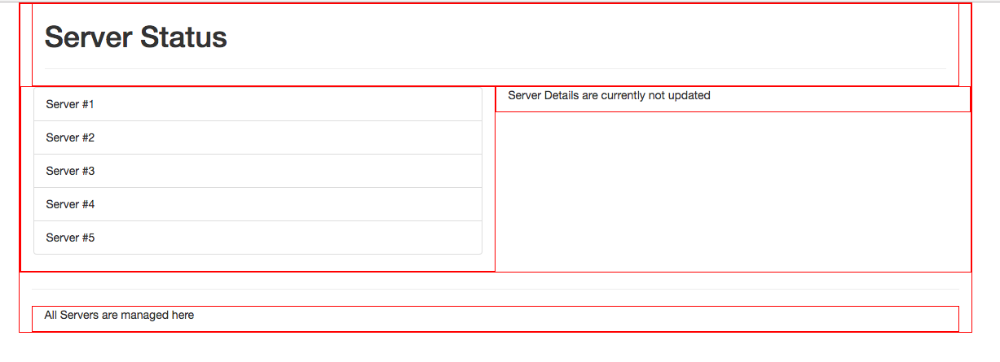
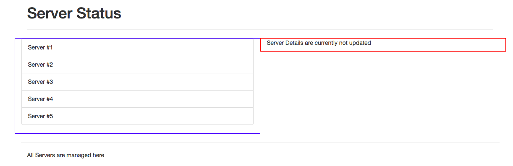
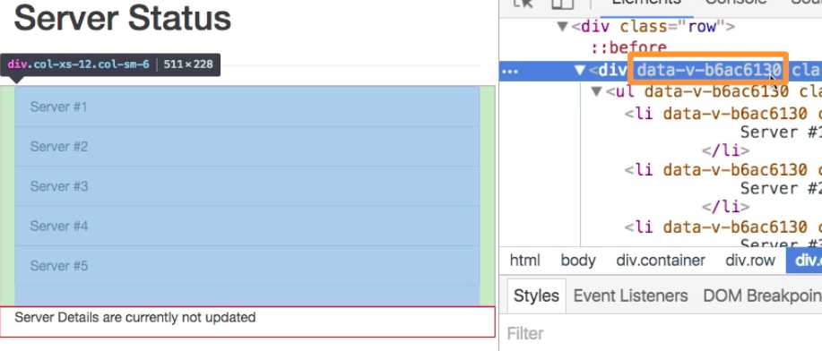

# Scoping Component Styles

Let's add some styling to our `components`.

In our `ServerDetails` component file:

```css
<style>
div{
    border: 1px, solid red;
}
</style>
```

In our `Servers` component file:

```css
<style>
div {
    border: 1px, solid blue;
}
</style>`
```

And we'll see a mistake 



This happens cos we didn't scope our styles, which means the styles are not contained in this particular `component`. By default any `style` we setup at any `component` will be applied globally. To override this let's add `scoped` to the style tag. 

In our `ServerDetails` component file:

```css
<style scoped>
div{
    border: 1px, solid red;
}
</style>
```

In our `Servers` component file:

```css
<style scoped>
div {
    border: 1px, solid blue;
}
</style>`
```


Behind the scenes this emulates the behavior name as the `shadow DOM`. The `shadow DOM` basically means that in the upcoming browser - each element has a DOM behind this element. So, we not only have one global DOM, but many sub-DOMs. A normal html tag could have a different style in one place and then in another place.

We can see this if we inspect these elements. The `div` with the blue border have a strange attribute added to it. 



The same is true for the `div` with the red border, but with a different id (49576052). 


This `attribute` which was added by VueJS is important, it's of course not a default `html attribute`, but it's also not one which is in conflict with any default `attribute`. Indeed it's using a default html `data` attribute, which allows us to attach custom data to elements. So, it's inline with a good html style. But where do we use this `attribute` for?

The `styles` we append in our single files are in the end pulled up into the head of our document - attached in the head section of the document.


In here we see VueJS added smth to our selector


It's now not only selecting by `div`, instead it is selecting by `div` and the `attribute`, this attribute surely aslo added to our `divs`. Our `styles` are only applied to the `elements` in a certain `component`. 
