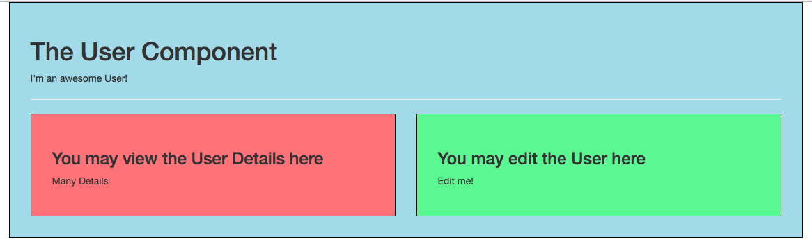
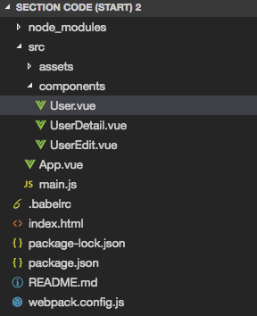
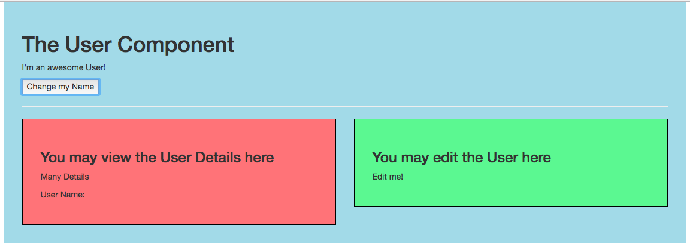

# Components Communication

Let's say we have this kind of application. 





**App.vue file**

```html
<template>
    <div class="container">
        <div class="row">
            <div class="col-xs-12">
                <app-user></app-user>
            </div>
        </div>
    </div>
</template>

<script>
    import User from './components/User.vue';

    export default {
        components: {
            appUser: User
        }
    }
</script>

<style>
    div.component {
        border: 1px solid black;
        padding: 30px;
    }
</style>
```

**User.vue file**

```html
<template>
    <div class="component">
        <h1>The User Component</h1>
        <p>I'm an awesome User!</p>
        <hr>
        <div class="row">
            <div class="col-xs-12 col-sm-6">
                <app-user-detail></app-user-detail>
            </div>
            <div class="col-xs-12 col-sm-6">
                <app-user-edit></app-user-edit>
            </div>
        </div>
    </div>
</template>

<script>
    import UserDetail from './UserDetail.vue';
    import UserEdit from './UserEdit.vue';

    export default {
        components: {
            appUserDetail: UserDetail,
            appUserEdit: UserEdit
        }
    }
</script>

<style scoped>
    div {
        background-color: lightblue;
    }
</style>
```

**UserDetail.vue file**

```html
<template>
    <div class="component">
        <h3>You may view the User Details here</h3>
        <p>Many Details</p>
    </div>
</template>

<script>
</script>

<style scoped>
    div {
        background-color: lightcoral;
    }
</style>
```

**UserEdit.vue file**

```html
<template>
    <div class="component">
        <h3>You may edit the User here</h3>
        <p>Edit me!</p>
    </div>
</template>

<script>
</script>

<style scoped>
    div {
        background-color: lightgreen;
    }
</style>
```
**main.js file**

```js
import Vue from 'vue'
import App from './App.vue'

new Vue({
  el: '#app',
  render: h => h(App)
})
```
Well, here we see a couple of `components`: we got a `root user component`, and twho `child components`. So, in the `App.vue` file we got our `user component` and in the `user component` we have two child components: `UserEdit` and `UserDetail`. We also use some scoped styling. The parent component has light-blue background and children are red and green relational. 

Now we wanna be able to pass `data` from the `parent` to a `child`. And to do this we wanna simulate that in our `user component` we have a `button` we can click to change some `data` which we pass downt to the `userDetail` component. 
So, we add a new `button` in our `user component`, we add click listener and of course we call a `method` we need to create. In order to change it, we need to have some `data` we wanna change, so we create a `data` property inn our `object`. And we also wanna have our `methods` property - here we have our `changeName` method and change the `data`(name) to `Dimi`. 

**User.vue file**

```html
<template>
    <div class="component">
        <h1>The User Component</h1>
        <p>I'm an awesome User!</p>
        <button @click="changeName">Change my Name</button> <!--add a button-->
        <hr>
        <div class="row">
            <div class="col-xs-12 col-sm-6">
                <app-user-detail></app-user-detail>
            </div>
            <div class="col-xs-12 col-sm-6">
                <app-user-edit></app-user-edit>
            </div>
        </div>
    </div>
</template>

<script>
    import UserDetail from './UserDetail.vue';
    import UserEdit from './UserEdit.vue';

    export default {
        data: function (){          //data property here
            return {
              name: 'Ana'
            }
        },
        methods: {                   //methods property here
            changeName(){
                this.name = 'Dimi';
            }
        },
        components: {
            appUserDetail: UserDetail,
            appUserEdit: UserEdit
        }
    }
</script>

<style scoped>
    div {
        background-color: lightblue;
    }
</style>
```

We wanna output the name in our `userDetail component`.  

**UserDetail.vue file**

```html
<template>
    <div class="component">
        <h3>You may view the User Details here</h3>
        <p>Many Details</p>
        <p>User Name: {{name}}</p>    <!--output name here-->
    </div>
</template>

<script>
</script>

<style scoped>
    div {
        background-color: lightcoral;
    }
</style>
```


