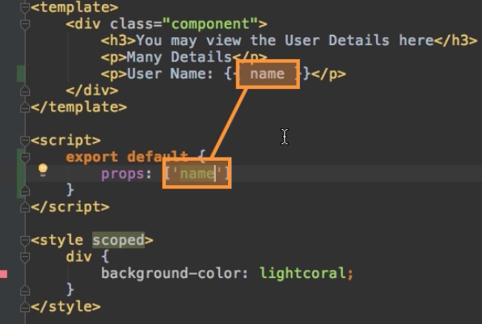
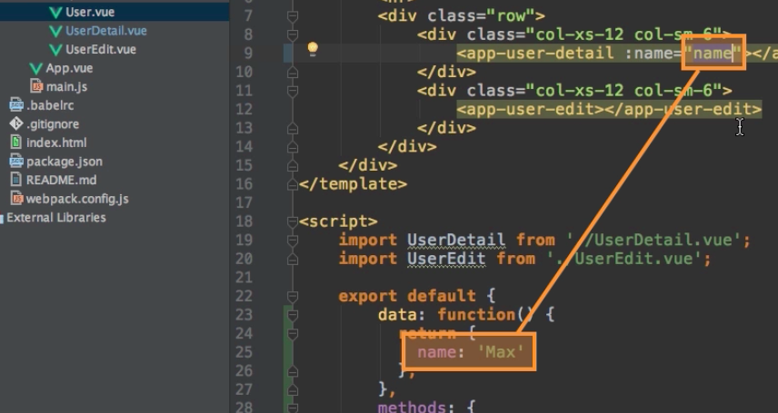
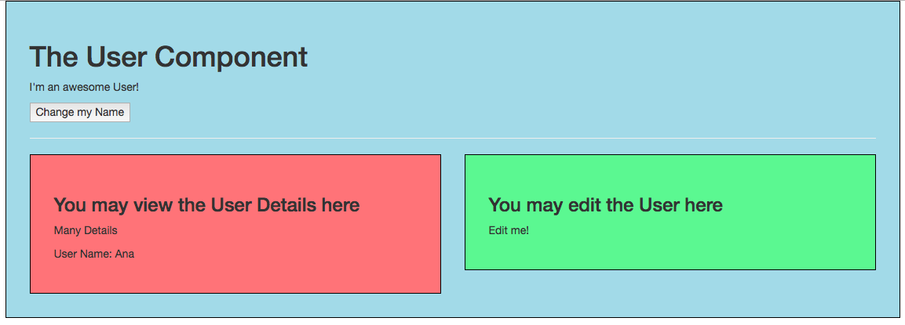

# Using Props for Parent=>Child Communication

For transferring `data` from the parent ot the child, we use `props` - it basically means properties set from outside, from the parent. 

To tell a child, in our example - `userDetails` component - that it receievs the data form outside we add the `props` property to the `object`. This happens to be an `array` and in this array we specify a couple of `strigns`, with each string we define a `property` which should be set from outside. 

**UserDetail.vue file**

```html
<template>
    <div class="component">
        <h3>You may view the User Details here</h3>
        <p>Many Details</p>
        <p>User Name: {{name}}</p>    
    </div>
</template>

<script>
export default{
    props: ['name']                           //add prope here 
}            
</script>

<style scoped>
    div {
        background-color: lightcoral;
    }
</style>
```

**IMPORTANT** The `name` we set as a string in the object has to match the {{name}} we set in our template, because behind the scenes this will create a new `property` we can use; just like the `property` we setup in our `data object`. 



In order to pass `name` we go to our `User` component and for `<app-user-detail>` say `:name = ` (using `v-bind`) and then whatever we wanna pass. With this we are reffering to the `name property` in the object. 



**User.vue file**

```html
<template>
    <div class="component">
        <h1>The User Component</h1>
        <p>I'm an awesome User!</p>
        <button @click="changeName">Change my Name</button> 
        <hr>
        <div class="row">
            <div class="col-xs-12 col-sm-6">
                <app-user-detail :name="name" ></app-user-detail>  <!--pass name here--> 
            </div>
            <div class="col-xs-12 col-sm-6">
                <app-user-edit></app-user-edit>
            </div>
        </div>
    </div>
</template>

<script>
    import UserDetail from './UserDetail.vue';
    import UserEdit from './UserEdit.vue';

    export default {
        data: function (){          
            return {
              name: 'Ana'
            }
        },
        methods: {                   
            changeName(){
                this.name = 'Dimi';
            }
        },
        components: {
            appUserDetail: UserDetail,
            appUserEdit: UserEdit
        }
    }
</script>

<style scoped>
    div {
        background-color: lightblue;
    }
</style>
```


Now we are passing a `dynamic property` using this `props` concept. 