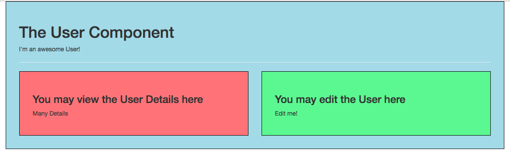

# Using 'props' in the Child Component

We can not only output the `props` in the `template`. We could also have a ` method` here. In the example below we have `switchName` method, where we simply can return `this.name.split('')` - to split on each character for example, then reverse it and then join it on each character. And then execute `switchName` in the template. 

**UserDetail.vue file**

```html
<template>
    <div class="component">
        <h3>You may view the User Details here</h3>
        <p>Many Details</p>
        <p>User Name: {{switchName()}}</p>    <!--execute the method-->
    </div>
</template>

<script>
export default{
    props: ['name'],
    methods: {
     switchName(){                                      //use props with methods in the child
      return this.name.split('').reverse().join('');
     }
    }                          
    
}            
</script>

<style scoped>
    div {
        background-color: lightcoral;
    }
</style>
```



Well, we can of course use `props` here like a normal `property` in our whole `vue object`: we can access it with `this`, we can access it like a normal `property` setup in the `data` object. 