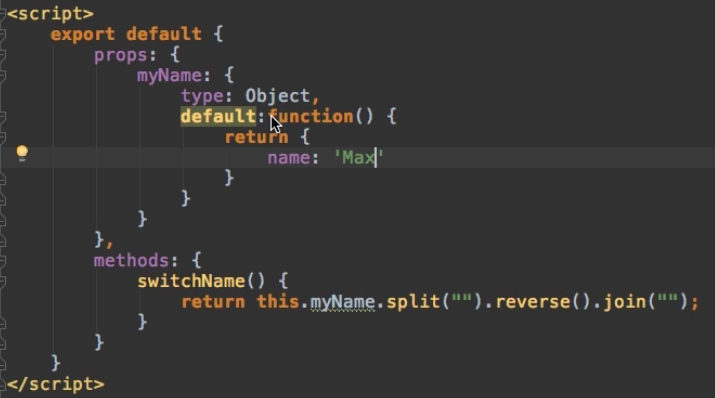

# Validating `props`

So, we built our component which uses `props` to get `data` from the parent. Maybe it's a reusable `component` we wanna use in multiple places and in each place it gets different `data`, but of course the type of `data` should always be equal. 
In our example we reversed the `name`, and this will non work if we will pass in a number, or a bolean, it has to be a `string` this component gets. 

**UserDetail.vue file**

```html
<template>
    <div class="component">
        <h3>You may view the User Details here</h3>
        <p>Many Details</p>
        <p>User Name: {{switchName()}}</p>   
    </div>
</template>

<script>
export default{
    props: ['name'],
    methods: {
     switchName(){                                      
      return this.name.split('').reverse().join('');
     }
    }                          
    
}            
</script>

<style scoped>
    div {
        background-color: lightcoral;
    }
</style>
```
So, in order to make sure we are not getting an error we need to validate the `props` coming in. We can setup validation in the `props` array (or `props` key on our `object`). `props` can not only be an `array`, if we want to validate it - it should be an `object`. And there we have as a key our property name, and then as a value the type of that. It could also be multiple times : `props: {name: [String, Array] }`. So, with this we are making sure we only get the `data` we wanna get. 

**UserDetail.vue file**

```html
<template>
    <div class="component">
        <h3>You may view the User Details here</h3>
        <p>Many Details</p>
        <p>User Name: {{switchName()}}</p>   
    </div>
</template>

<script>
export default{
    props: {
     name: String                //validate the data 
    },
    methods: {
     switchName(){                                      
      return this.name.split('').reverse().join('');
     }
    }                          
    
}            
</script>

<style scoped>
    div {
        background-color: lightcoral;
    }
</style>
```

In this case, when we validate the data, but use e.g a number instead of string - we'll get a warning at development time.
When setting up the types of `properies` - it can also be an `object`, where we set the type and `required` to true - to make sure this is the `property` which always is a string and it should always be available, always be passed. By setting `required` to true we are making sure this `component` may only be used if this `property` is passed.  

**UserDetail.vue file**

```html
<template>
    <div class="component">
        <h3>You may view the User Details here</h3>
        <p>Many Details</p>
        <p>User Name: {{switchName()}}</p>   
    </div>
</template>

<script>
export default{
    props: {
     name: {
         type: String,           //object 
         required: true
     }                 
    },
    methods: {
     switchName(){                                      
      return this.name.split('').reverse().join('');
     }
    }                          
    
}            
</script>

<style scoped>
    div {
        background-color: lightcoral;
    }
</style>
```
We can also set a `default` value. `default` would be set in case of a string  - some string. In our `User.vue` file we don't need to pass the `property`. 

**UserDetail.vue file**

```html
<template>
    <div class="component">
        <h3>You may view the User Details here</h3>
        <p>Many Details</p>
        <p>User Name: {{switchName()}}</p>   
    </div>
</template>

<script>
export default{
    props: {
     name: {
         type: String,           
         default:  "Ana Mo"            //set default value
     }                 
    },
    methods: {
     switchName(){                                      
      return this.name.split('').reverse().join('');
     }
    }                          
    
}            
</script>

<style scoped>
    div {
        background-color: lightcoral;
    }
</style>
```

**User.vue file**

```html
<template>
    <div class="component">
        <h1>The User Component</h1>
        <p>I'm an awesome User!</p>
        <button @click="changeName">Change my Name</button> 
        <hr>
        <div class="row">
            <div class="col-xs-12 col-sm-6">
                <app-user-detail></app-user-detail>  <!--don't need to pass a property-->
            </div>
            <div class="col-xs-12 col-sm-6">
                <app-user-edit></app-user-edit>
            </div>
        </div>
    </div>
</template>

<script>
    import UserDetail from './UserDetail.vue';
    import UserEdit from './UserEdit.vue';

    export default {
        data: function (){          
            return {
              name: 'Ana'
            }
        },
        methods: {                   
            changeName(){
                this.name = 'Dimi';
            }
        },
        components: {
            appUserDetail: UserDetail,
            appUserEdit: UserEdit
        }
    }
</script>

<style scoped>
    div {
        background-color: lightblue;
    }
</style>
```

If e.g the type is an `object` or an `arraya` - then the `default` should always be a `function`, which returns the `object`. For primitive types like a `string`, `bolean` or a `number` - we set the default value directly. 



