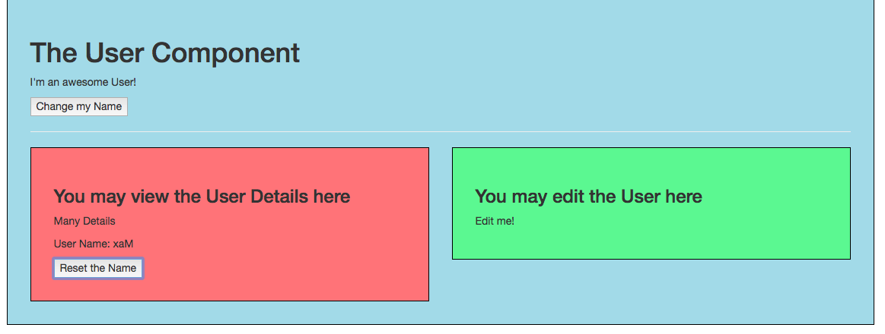

# Using Custom Events for Child=>Parent Communication

 What if we wanna pass `data` from a child to a parent? So, that the parent `component` gets informed about something or gets a `new` value. 

 Let's say in our `UserDetail` component we wanna have the `button` which allows us to reset the `name`. And here `on click` we wanna execute a `function`. For that we add this `function` in our `object's methods property`. 

**Important note** It's perfectly fine to access a `property` like this, but if that weren't a `string`, a `number` or a `boolen`, but instead an `array` or an `object` - keep in mind that `objects` and `arrays` are reference types. Which means they only exist in memory once and the `properires` storing them, actually store only a pointer to that place in memory. So, if we pass an `object` or an `array` from the parent to the child `component`, we actually pass the pointer to the place in memory. If we change it in the child `component` we change it in the `object memory` which only exist once, so we also change in in the parent `component`.  

**UserDetail component**

```html
<template>
    <div class="component">
        <h3>You may view the User Details here</h3>
        <p>Many Details</p>
        <p>User Name: {{switchName()}}</p>
        <button @click="resetName">Reset the Name</button>    <!--button here-->
    </div>
</template>

<script>
export default {
    props: ['name'],
    methods: {
     switchName(){
      return this.name.split('').reverse().join('');
     },
     resetName(){                   //reset name function here
         this.name = "Max"
     }
    }
}
</script>

<style scoped>
    div {
        background-color: lightcoral;
    }
</style>
```


Now we also wanna send it back to the parent `component` when pushing the `Change my Name` button. So, we need to inform the parent `component` that the name did change. And to do so we will need to emit a `custom event`. In each `vue instance` (components work as a separate vue instanse) we get access to `$emit()` method. This is a build-in `method`. On the `$emit()` we specify the `event` we want ot emit (change any name you like), as a second `argument` you can pass some `data`. 

**UserDetail component**

```html
<template>
    <div class="component">
        <h3>You may view the User Details here</h3>
        <p>Many Details</p>
        <p>User Name: {{switchName()}}</p>
        <button @click="resetName">Reset the Name</button>
    </div>
</template>

<script>
export default {
    props: ['name'],
    methods: {
     switchName(){
      return this.name.split('').reverse().join('');
     },
     resetName(){
         this.name = "Max";
         this.$emit('nameWasReset', this.name)     //use emit method 
     }
    }
}
</script>

<style scoped>
    div {
        background-color: lightcoral;
    }
</style>
``` 

Now in the parent `component` we can listen to that. We can listen to that like any other `event` - `@nameWasReset="name=$event` - using `v-on directive`, using the name of the `event` and then we can execute some code. We can execute a `method` here or simply saying `'name'`, which is the property we were using to store the name in the `User` component equals `$event`, where `$event` refers to the `data` which was passed through the event. 

**User component**

```html
<template>
    <div class="component">
        <h1>The User Component</h1>
        <p>I'm an awesome User!</p>
        <button @click="changeName">Change my Name</button>
        <hr>
        <div class="row">
            <div class="col-xs-12 col-sm-6">
                <app-user-detail :name='name' @nameWasReset="name=$event"></app-user-detail>  <!--listen to emit-->
            </div>
            <div class="col-xs-12 col-sm-6">
                <app-user-edit></app-user-edit>
            </div>
        </div>
    </div>
</template>

<script>
    import UserDetail from './UserDetail.vue';
    import UserEdit from './UserEdit.vue';

    export default {
        data: function (){
            return {
             name: 'Ana'
            }
        },
        methods: {
            changeName(){
                this.name = 'Dimi';
            }
        },
        components: {
            appUserDetail: UserDetail,
            appUserEdit: UserEdit
        }
    }
</script>

<style scoped>
    div {
        background-color: lightblue;
    }
</style>
```
