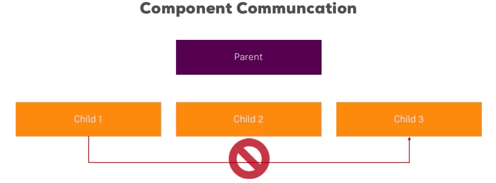
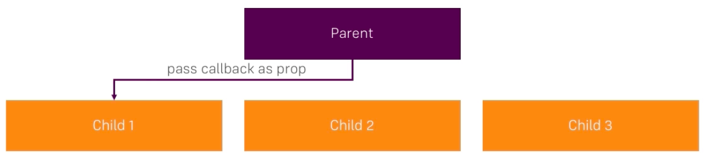
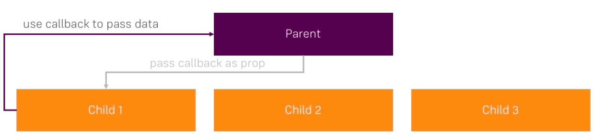
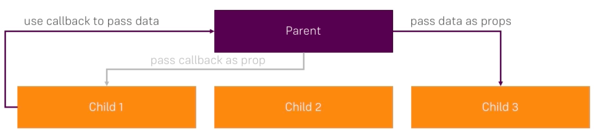

# Unidirectional Data Flow

Let's look at how `data` travels in the `VueJS` application. Let's we have a `parent` and three `child` components. Generally if we wanna rich one child form the other it won't work, cos our communication is uniderictional, which means it only travels from parent to children, or from children to parent. 

Instead we have to take that our parent gives us some `method` we can execute. 

Whwen we execute this `method` provided by the parent (it was provided via a `prop`) this will run in the parent, alternatively we would use the custom `event` to which the parent listens to. 

And then the parent can pass the updated `data` to the child number three. 

This is `unidirectional data flow`.