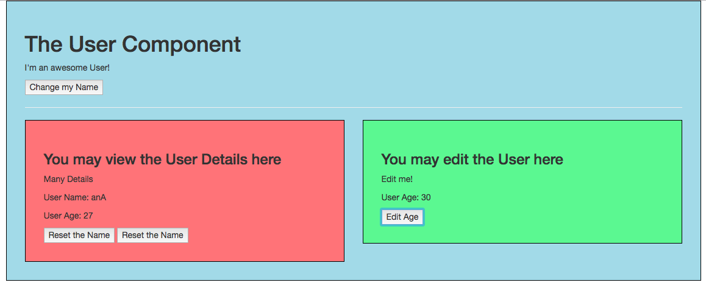
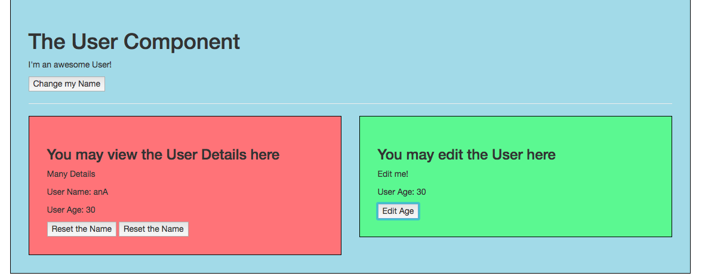

# Communication between Sibling Components

Let's say we want to get some `data` from one child to another one. We actually have three different ways of doing so. 

### Way number 1

Let's say in the `UserEdit` component we will have a new `button`, which allows us to edit the age. We'll add a click listner. And add the `method` in the object. 

**UserEdit component**

```html
<template>
    <div class="component">
        <h3>You may edit the User here</h3>
        <p>Edit me!</p>
        <button @click="editAge"></button>   <!--a new button-->
    </div>
</template>

<script>
export default{
 methods:{
     editAge(){         //add method here
         this.age = '30';
     }
 }
}
</script>

<style scoped>
    div {
        background-color: lightgreen;
    }
</style>
```

We will store the `age` in the parent `component` (User.vue) in our `data object`, and set it as `27` by default. We wanna pass it as a `prop`, and refer to the `age` in our `data property` to the `UserEdit` component. So, in the `UserEdit` component we create a `prop`. Let's say in `UseDetail` we also wanna output the `age`. So, in `User.vue` component we also pass `userAge` reffering to the age in the parent `component`. 

**User.vue**

```html
<template>
    <div class="component">
        <h1>The User Component</h1>
        <p>I'm an awesome User!</p>
        <button @click="changeName">Change my Name</button>
        <hr>
        <div class="row">
            <div class="col-xs-12 col-sm-6">
                <app-user-detail :name='name' @nameWasReset="name=$event" :resetFn="resetName" :userAge="age"></app-user-detail>   <!--add as a prop-->
            </div>
            <div class="col-xs-12 col-sm-6">
                <app-user-edit :userAge="age"></app-user-edit> <!--add as a prop-->
            </div>
        </div>
    </div>
</template>

<script>
    import UserDetail from './UserDetail.vue';
    import UserEdit from './UserEdit.vue';

    export default {
        data: function (){
            return {
             name: 'Ana',
             age: 27      //store the age here 
            }
        },
        methods: {
            changeName(){
                this.name = 'Dimi';
            },
            resetName(){
                this.name = "Ana"
            }
        },
        components: {
            appUserDetail: UserDetail,
            appUserEdit: UserEdit
        }
    }
</script>

<style scoped>
    div {
        background-color: lightblue;
    }
</style>
```

**UserEdit component**

```html
<template>
    <div class="component">
        <h3>You may edit the User here</h3>
        <p>Edit me!</p>
        <p>User Age: {{userAge}}</p>
        <button @click="editAge"></button>   <!--a new button-->
    </div>
</template>

<script>
export default{
 props: ['userAge']   //create a props here
 methods:{
     editAge(){         //add method here
         this.userAge = '30';
     }
 }
}
</script>

<style scoped>
    div {
        background-color: lightgreen;
    }
</style>
```

And in `Userdetail` we add a new `prop` with a `number` type. And from there we wanna get the update form the `UserEdit` component. In the template let's add a `userAge` prop. 

**UserDetail**
```html
<template>
    <div class="component">
        <h3>You may view the User Details here</h3>
        <p>Many Details</p>
        <p>User Name: {{switchName()}}</p>
         <p>User Age: {{userAge}}</p>    <!--userAge property-->
        <button @click="resetName">Reset the Name</button>
         <button @click="resetFn()">Reset the Name</button>
    </div>
</template>

<script>
export default {
    props: {
        name: {
            type: String
            },
        resetFn: Function,
        userAge: Number  //new prop 
            },
    methods: {
     switchName(){
      return this.name.split('').reverse().join('');
     },
     resetName(){
         this.name = "Max";
         this.$emit('nameWasReset', this.name)
     }
    }
}
</script>

<style scoped>
    div {
        background-color: lightcoral;
    }
</style>
```

Now we change the `data` only in `UserEdit` component. The reason for thai it the change is only happens in the `UserEdit` component, we are not passing it to our parent component. 



So one way to do this is to use a `custom event`. So, in `UserEdit` component we call `$emit` method and pass an event named 'ageWasEdited' and `userAge` as an argument. 

**UserEdit component**

```html
<template>
    <div class="component">
        <h3>You may edit the User here</h3>
        <p>Edit me!</p>
        <p>User Age: {{userAge}}</p>
        <button @click="editAge"></button>   
    </div>
</template>

<script>
export default{
 props: ['userAge']   
 methods:{
     editAge(){         
         this.userAge = '30';
         this.$emit('ageWasEdited', this.userAge ) // call emit method 
     }
 }
}
</script>

<style scoped>
    div {
        background-color: lightgreen;
    }
</style>
```

Then in our parent `User` component we can setup in our `<app-user-edit>` component in the template a listner with the name of the `event`, and refer to the `data` which was passed with the `event`. 

**User.vue**

```html
<template>
    <div class="component">
        <h1>The User Component</h1>
        <p>I'm an awesome User!</p>
        <button @click="changeName">Change my Name</button>
        <hr>
        <div class="row">
            <div class="col-xs-12 col-sm-6">
                <app-user-detail :name='name' @nameWasReset="name=$event" :resetFn="resetName" :userAge="age"></app-user-detail>
            </div>
            <div class="col-xs-12 col-sm-6">
                <app-user-edit :userAge="age" @ageWasEdited="age=$event"></app-user-edit>
            </div>
        </div>
    </div>
</template>

<script>
    import UserDetail from './UserDetail.vue';
    import UserEdit from './UserEdit.vue';

    export default {
        data: function (){
            return {
             name: 'Ana',
             age: 27
            }
        },
        methods: {
            changeName(){
                this.name = 'Dimi';
            },
            resetName(){
                this.name = "Ana"
            }
        },
        components: {
            appUserDetail: UserDetail,
            appUserEdit: UserEdit
        }
    }
</script>

<style scoped>
    div {
        background-color: lightblue;
    }
</style>
```

Now if we click `edit age` button, the data will be changed in both `child components`. 



### Way number 2

The second solution will be to use a `callback function`. It's basically the same approach as we used before. 