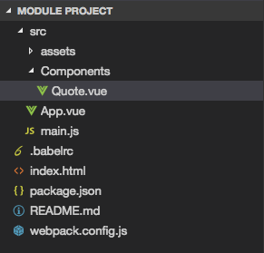
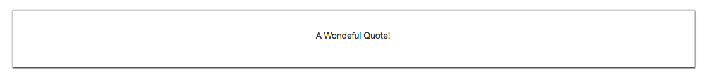

# Setting up the Module Project

Here is a project folder structure from the begginning.



So, we wanna use `Quote`  inside the `App.vue`. 

**Quote.vue**

```html
<template>
<div>
    <p>A Wondeful Quote!</p>
</div>
</template>

<script>

</script>

<style scoped>
div{
    border: 1px solid #ccc;
    box-shadow: 1px 1px 2px black;
    padding: 30px;
    margin: 30px auto;
    text-align: center;
}

</style>
```

With the simple `Quote` setup we can use it in the `App.vue` and register it locally. 

**App.vue**

```html
<template>
    <div class="container">
        <div class="row">
            <div class="col-xs-12">
               <app-quote></app-quote>
            </div>
        </div>
    </div>
</template>

<script>
import Quote from './components/Quote.vue'
    export default {
        components:{
            'app-quote': Quote
        }
    }
</script>

<style>
</style>
```



The thing is, we wanna dinamically set this content from outside, from the parent `component`. We could do this with `props` (look further in `002_Passing Content - The Suboptimal Solution` file). 


