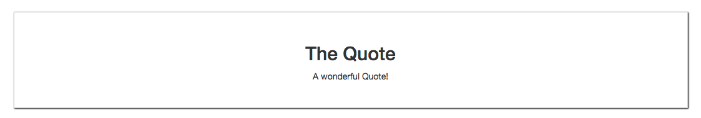

# Passing Content with Slots

Well, we use `slots` very simple. All we do in the child `component` when we wanna recieve the `data` we add `<slot></slot>` in the template. 

**App.vue**

```html
<template>
    <div class="container">
        <div class="row">
            <div class="col-xs-12">
               <app-quote>          <!--enclose in the quote-->
               <h2>The Quote</h2>
               <p>A wonderful Quote!</p>
               </app-quote>  
            </div>
        </div>
    </div>
</template>

<script>
import Quote from './components/Quote.vue'
    export default {
        components:{
            'app-quote': Quote
        }
    }
</script>

<style>
</style>
```

**Quote.vue**

```html
<template>
<div>
    <slot></slot>      <!--add slot here-->
</div>
</template>

<script>
export default{
      
}
</script>

<style scoped>
div{
    border: 1px solid #ccc;
    box-shadow: 1px 1px 2px black;
    padding: 30px;
    margin: 30px auto;
    text-align: center;
}

</style>
```



The `slot` here is taking over and renders the content we are passing from outside. 