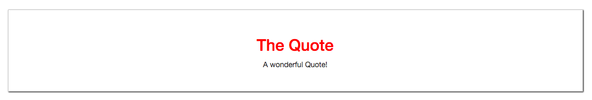

# How Slot Content gets Compiled and Styled

It's important to understand where the code, we are passing in the `App.vue` is compiled though. So, actually the styling is used in the `Quote.vue` child component. So, the `child component` style is applyed to the `data` being passed from outside.  

**E.G.**

**Quote.vue**

```html
<template>
<div>
    <slot></slot>      <!--add slot here-->
</div>
</template>

<script>
export default{
      
}
</script>

<style scoped>
div{
    border: 1px solid #ccc;
    box-shadow: 1px 1px 2px black;
    padding: 30px;
    margin: 30px auto;
    text-align: center;
}

h2{
    color : red;
}

</style>
```



There is second **important thing** to keep in mind and that works exactly the opposite. Everything else (except the style) is set in the `parent component`. 

**Exapmle**

Let's say the `quote heading` in a parent `App.vue` would be a dinamic content, so we set it in the object, and use the string interpolation in the template.  

**App.vue**

```html
<template>
    <div class="container">
        <div class="row">
            <div class="col-xs-12">
               <app-quote>         
               <h2>{{ quoteTitle }}</h2>
               <p>A wonderful Quote!</p>
               </app-quote>  
            </div>
        </div>
    </div>
</template>

<script>
import Quote from './components/Quote.vue'
    export default {
        components:{
            'app-quote': Quote
        },
        data: function(){
            return{
            quoteTitle: 'The Quote!'
            };
        }
    }
</script>

<style>
</style>
```

Actually, it works!


So, for compiling the `template` which means rendering any kind of `VueJS` operation we are doing, the `component` where we actually have the `code` in the `template` will be the one doing the changes. Even though we pass it in the `child component` it is in parent component's template. 

