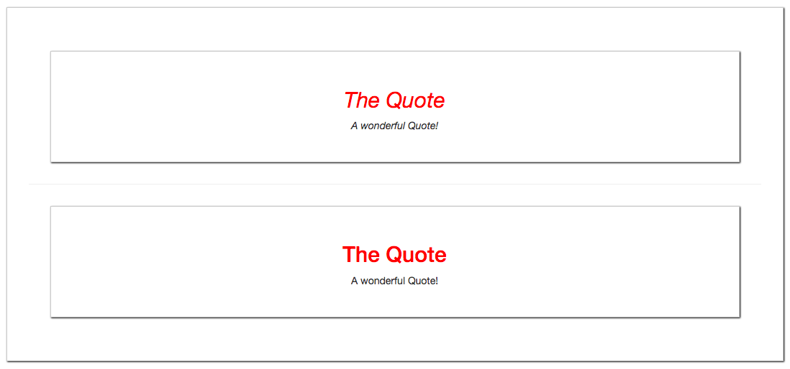
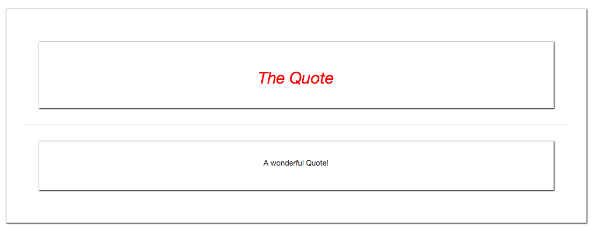

# Using Multiple Slots (Named Slots)

What if in our template in the `child component` we wanna render html code in two different places. So, we wanna two diferent `slots`, one for the `<title>` and one for the `<content>`.

Well, for example we add two `slots` in our child component. 

**Quote.vue**

```html
<template>
<div>
    <div class="title"> 
        <slot></slot>          <!--slot for the title-->
    </div>
    <hr>
</div>
<slot></slot>                  <!--slot for the content-->
</div>
</div>
</template>

<script>

</script>

<style scoped>
div{
    border: 1px solid #ccc;
    box-shadow: 1px 1px 2px black;
    padding: 30px;
    margin: 30px;
    text-align: center;
}
h2{
    color : red;
}
.title{
    font-style: italic; 
}
</style>
```

If we do it like this, we'll get two elements which are the same, one time italic and one time not. 



Well, it could be the behavior we want, but what if we wanna split the `title` and the `content`. Well, in this case we can setup `named slots`. 

**Quote.vue**

```html
<template>
<div>
    <div class="title"> 
        <slot name="title"></slot>     <!--name for the title slot-->
    </div>
    <hr>
</div>
<slot name="content"></slot>          <!--name for the content slot-->
</div>
</div>
</template>

<script>

</script>

<style scoped>
div{
    border: 1px solid #ccc;
    box-shadow: 1px 1px 2px black;
    padding: 30px;
    margin: 30px;
    text-align: center;
}
h2{
    color : red;
}
.title{
    font-style: italic; 
}
</style>
```

And then in the `parent component` where we have the content we wanna pass we should add a new `attribute`. 

**App.vue**

```html
<template>
    <div class="container">
        <div class="row">
            <div class="col-xs-12">
               <app-quote>
                <h2 slot="title">The Quote</h2>    <!--add attribute-->
               <p slot="content">A wonderful Quote!</p> <!--add attribute-->
               </app-quote>
            </div>
        </div>
    </div>
</template>

<script>
import Quote from './components/Quote.vue'
    export default {
        components:{
            'app-quote': Quote
        }
    }
</script>

<style>
</style>
```



