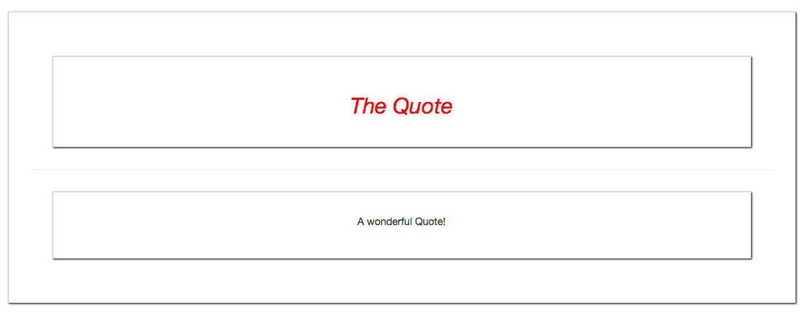

# Default Slots and Slot Defaults

What we could also do is to have one `named slot` and one ` unnamed slot` without a name and the attribute in the parent component. VueJS will treat the `unnamed slot` as the `default slot`. So, everuthing wa are passing in, which doesn't have a `named slot`   - such content will automatically be rendered in the `default slot`. 

**Quote.vue**

```html
<template>
<div>
    <div class="title"> 
        <slot name="title"></slot>     <!--slot with a name-->
    </div>
    <hr>
</div>
<slot></slot>          <!-- slot without a name-->
</div>
</div>
</template>

<script>

</script>

<style scoped>
div{
    border: 1px solid #ccc;
    box-shadow: 1px 1px 2px black;
    padding: 30px;
    margin: 30px;
    text-align: center;
}
h2{
    color : red;
}
.title{
    font-style: italic; 
}
</style>
```

**App.vue**

```html
<template>
    <div class="container">
        <div class="row">
            <div class="col-xs-12">
               <app-quote>
                <h2 slot="title">The Quote</h2>    <!--there is an  attribute-->
               <p>A wonderful Quote!</p> <!--no attribute-->
               </app-quote>
            </div>
        </div>
    </div>
</template>

<script>
import Quote from './components/Quote.vue'
    export default {
        components:{
            'app-quote': Quote
        }
    }
</script>

<style>
</style>
```

Here, we'll get the same result as before.



And we also can setup a `default content` to be displayed. Let's say we are not sure if we recieve a third element. Let's say we have a `<span>` and wanna have a `slot` with a `subtitle`. And we don't know if we get some `data` passed in or not. So, in out `App.vue` parent component we don't setup any subtitle. But in this case we can setup this subtitle in the child component. 

**Quote.vue**

```html
<template>
<div>
    <div class="title"> 
        <slot name="title"></slot>  
        <span style="color: #CCCC">
     <slot name="subtitle">The Subtitle</slot>  <!--a third slot here with the subtitle set-->
     </span>   
    </div>
    <hr>
</div>
<slot></slot>          
</div>
</div>
</template>

<script>

</script>

<style scoped>
div{
    border: 1px solid #ccc;
    box-shadow: 1px 1px 2px black;
    padding: 30px;
    margin: 30px;
    text-align: center;
}
h2{
    color : red;
}
.title{
    font-style: italic; 
}
</style>
```

**App.vue**

```html
<template>
    <div class="container">
        <div class="row">
            <div class="col-xs-12">
               <app-quote>
                <h2 slot="title">The Quote</h2>    <!--there is no subtitle here-->
               <p>A wonderful Quote!</p> 
               </app-quote>
            </div>
        </div>
    </div>
</template>

<script>
import Quote from './components/Quote.vue'
    export default {
        components:{
            'app-quote': Quote
        }
    }
</script>

<style>
</style>
```


Well, the subtitle is the `default content` which we simply introduce by writing it between an openning and closing `slot` tag. Whenever we do the nedded content, this `default content` will get replaced.