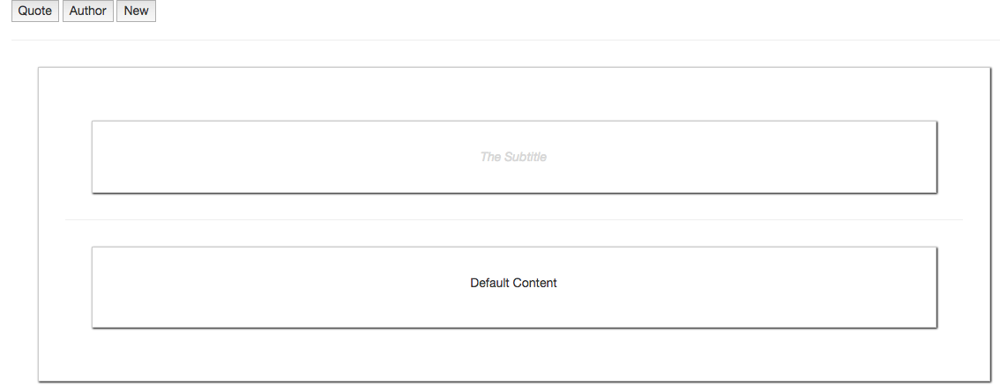
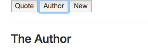
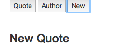

# Switching Multiple Components with Dynamic Components

What are dynamic components? Let's say we have `app-author` component and `app-new` component registered in our `App.vue` general component. 

**App.vue**

```html
<template>
    <div class="container">
        <div class="row">
            <div class="col-xs-12">
               <app-quote>
                <h2 slot="title">The Quote</h2>    
               <p>A wonderful Quote!</p> 
               </app-quote>
            </div>
        </div>
    </div>
</template>

<script>
import Quote from './components/Quote.vue';
import Author from './components/Author.vue';
import New from './components/New.vue';

    export default {
        components:{
            'app-quote': Quote,     
            'app-author': Author,    //a new component
            'app-new': New           //a new component
        }
    }
</script>

<style>
</style>
```

**Author.vue**

```html
<template>
<div>
   <h3>The Author</h3>
</div>
</template>

<script>

</script>

<style>
</style>
```

**New.vue**

```html
<template>
<div>
   <h3>New Quote</h3>
</div>
</template>

<script>

</script>

<style>
</style>
```
Now we have three separate componens. And we wanna decide which one we will display in our `App.vue` template code. But we don't want to add all selectors to the `App.vue` code, instead we want to have one place in the code where we wanna display any of the three `components`, depending on which `button` was pressed. 

**App.vue**

```html
<template>
    <div class="container">
        <div class="row">
            <div class="col-xs-12">
                <button>Quote</button> <!--add a button-->
                <button>Author</button> <!--add a button-->
                <button>New</button> <!--add a button-->
                <hr>
               <app-quote>
                <h2 slot="title">The Quote</h2>    
               <p>A wonderful Quote!</p> 
               </app-quote>
            </div>
        </div>
    </div>
</template>

<script>
import Quote from './components/Quote.vue';
import Author from './components/Author.vue';
import New from './components/New.vue';

    export default {
        components:{
            'app-quote': Quote,     
            'app-author': Author,    //a new component
            'app-new': New           //a new component
        }
    }
</script>

<style>
</style>
```

To make this happen we need to add a new field in our `data property` and there we wanna store the new `property` named, let's say `selectedComponent`, and by default this will be our `app-quote` component (use the name of the selector). Then we need to use the `click listner` for our `buttons`. 

**App.vue**

```html
<template>
    <div class="container">
        <div class="row">
            <div class="col-xs-12">
                <button @click="selectedComponent = 'app-quote'">Quote</button> <!--listen to data-->
                <button @click="selectedComponent = 'app-author'">Author</button> <!--listen to data-->
                <button @click="selectedComponent = 'app-new'">New</button> <!--listen to data-->
                <hr>
               <app-quote>
                <h2 slot="title">The Quote</h2>    
               <p>A wonderful Quote!</p> 
               </app-quote>
            </div>
        </div>
    </div>
</template>

<script>
import Quote from './components/Quote.vue';
import Author from './components/Author.vue';
import New from './components/New.vue';

    export default {
        data: function(){
            return {
                selectedComonent: 'app-quote'    //new data property
            }
        },
        components:{
            'app-quote': Quote,     
            'app-author': Author,    
            'app-new': New           
        }
    }
</script>

<style>
</style>
```

Now we actually wanna change the loaded `component`. To do this we use a so-called `dynamic component`. We'll use the `<component>` selector in the template. It allows us dynamically add components. We can bind the `component` selector to a `property` which holds the `component` which should get loaded. To bind it we have to use `is` attribute. Well, the `<component :is="selectedComponent"></component>` gets bound to the `selectedComponent property` in the `data object`. It will then have a look at the `value` of `selectedComponent` which has to be a `string`. And this `string` is then interpreted as the `selector` of the `component`, which now should get loaded dynamically. 

**App.vue**

```html
<template>
    <div class="container">
        <div class="row">
            <div class="col-xs-12">
                <button @click="selectedComponent = 'app-quote'">Quote</button> 
                <button @click="selectedComponent = 'app-author'">Author</button> 
                <button @click="selectedComponent = 'app-new'">New</button> 
                <hr>
                <component :is="selectedComponent">  <!--component selector here-->
                <p>Default Content</p>
                </component>          
            </div>
        </div>
    </div>
</template>

<script>
import Quote from './components/Quote.vue';
import Author from './components/Author.vue';
import New from './components/New.vue';

    export default {
        data: function(){
            return {
                selectedComonent: 'app-quote'    
            }
        },
        components:{
            'app-quote': Quote,     
            'app-author': Author,    
            'app-new': New           
        }
    }
</script>

<style>
</style>
```






