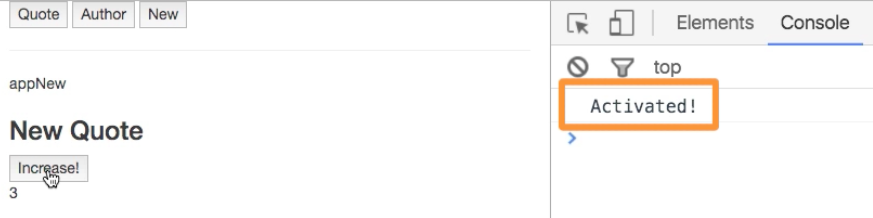
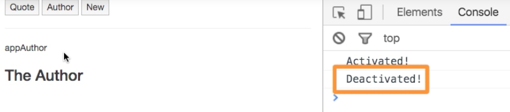

# Dynamic Component Lifecycle Hooks

Well, as our `dynamic component` is kept alive we lose our `destroyed` lifecycle hook. We have two lifecycle hooks to control if a `dynamic component` is currently visited, so it was activated, or we navigate it away, so it was deactivated. 
We can implement these two `lifesycle hooks` in or components. So, `deactivated()` will be executed whenever we are on the `component` and load another one. And the other hook is - `activated()` method which is called whenever we do load the dynamic component. 


**New.vue**

```html
<template>
<div>
   <h3>New Quote</h3>
</div>
</template>

<script>
export default {
    deactivated(){                  //deactivated hook
     console.log('Deactivated');
    },
    activated(){                    //activated hook
     console.log('Activated');
    }
}
</script>

<style>
</style>
```



