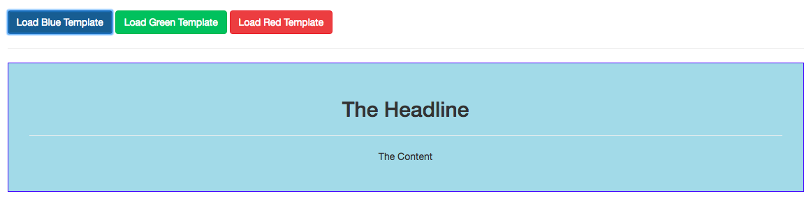

# Challenge

1. Pass in some `content` to each of the `template`.
2. Hook up the `buttons` and some `templates` so, that only one of the templates is displayed, and other two are not, and we can switch them.

Here is our project folder structure. 


### Solution

**App.vue**

```html
<template>
    <div class="container">
        <div class="row">
            <div class="col-xs-12">
                <br>
                <button class="btn btn-primary" @click="selectTemplate='appBlue'">Load Blue Template</button>
                <button class="btn btn-success" @click="selectTemplate='appGreen'" >Load Green Template</button>
                <button class="btn btn-danger" @click="selectTemplate='appRed'">Load Red Template</button>
                <hr>
                <component :is='selectTemplate'></component>
            </div>
        </div>
    </div>
</template>

<script>
    import Blue from './components/Blue.vue';
    import Green from './components/Green.vue';
    import Red from './components/Red.vue';

    export default {
        components: {
            appBlue: Blue,
            appGreen: Green,
            appRed: Red
        },
        data: function(){
            return{
                selectTemplate: 'appBlue'
            };
        }
    }
</script>

<style>
</style>
```

**Blue.vue**

```html
<template>
    <div>
        <slot>
            <h2>The Headline</h2>          
        </slot>
        <hr>
        <slot>
            <p>The Content</p>
        </slot>
    </div>
</template>

<script>

</script>

<style scoped>
    div {
        border: 1px solid blue;
        background-color: lightblue;
        padding: 30px;
        margin: 20px auto;
        text-align: center
    }
</style>
```
**Green.vue**
```html
<template>
    <div>
        <slot>
            <h2>The Headline</h2>
                    
        </slot>
        <hr>
        <slot>
            <p>The Content</p>
        </slot>
    </div>
</template>

<script>

</script>

<style scoped>
    div {
        border: 1px solid green;
        background-color: lightgreen;
        padding: 30px;
        margin: 20px auto;
        text-align: center
    }
</style>
```
**Red.vue**

```html
<template>
    <div>
        <slot>
            <h2>The Headline</h2>
                    
        </slot>
        <hr>
        <slot>
            <p>The Content</p>
        </slot>
    </div>
</template>

<script>

</script>

<style scoped>
    div {
        border: 1px solid red;
        background-color: lightcoral;
        padding: 30px;
        margin: 20px auto;
        text-align: center
    }
</style>
```
**main.js**

```js
import Vue from 'vue'
import App from './App.vue'

new Vue({
  el: '#app',
  render: h => h(App)
})
```

**index.html**

```html
<!DOCTYPE html>
<html lang="en">
  <head>
    <meta charset="utf-8">
    <title>Vue Components</title>
    <link rel="stylesheet" href="https://maxcdn.bootstrapcdn.com/bootstrap/3.3.7/css/bootstrap.min.css" integrity="sha384-BVYiiSIFeK1dGmJRAkycuHAHRg32OmUcww7on3RYdg4Va+PmSTsz/K68vbdEjh4u" crossorigin="anonymous">
  </head>
  <body>
    <div id="app">
    </div>
    <script src="/dist/build.js"></script>
  </body>
</html>
```



