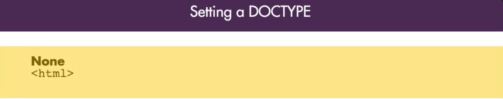
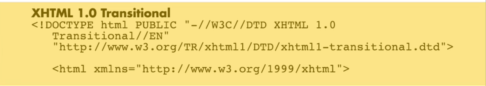
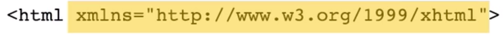
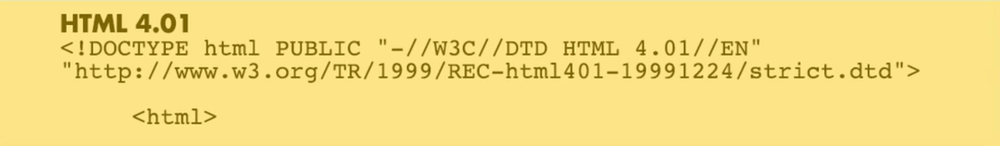

# Setting a DOCTYPE

There is a few different reccomendations about the `doctype` in the html file.

1. Some email clients and html services will reccomend you don't use any `doctype` and you simply start the document with `html`

2. Others will recommend to use: `XHTML 1.0 Transitional`, 

in which case `html` needs an `attribute` for the `xml name space`. 

3. The others will recommend you use: `HTML 4.01` 

