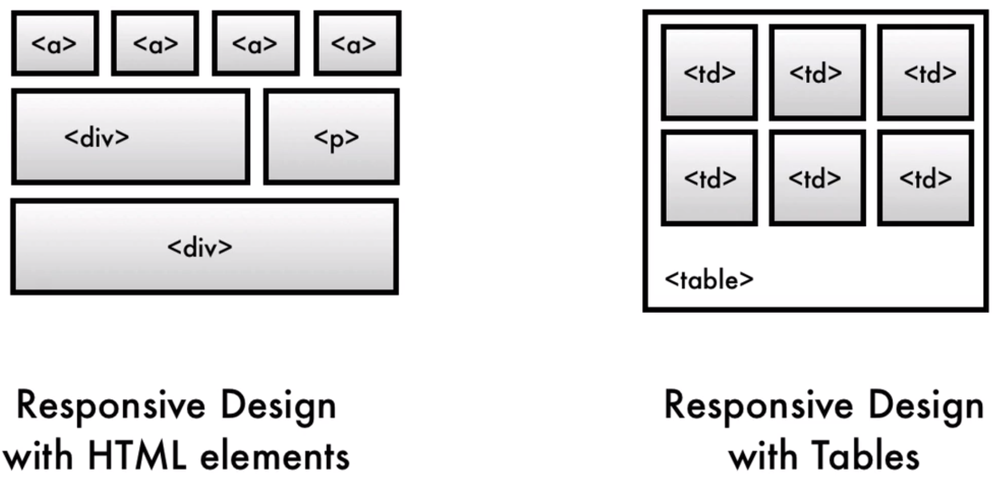
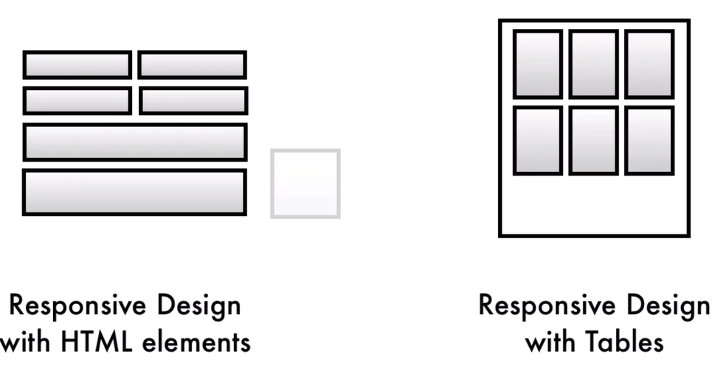
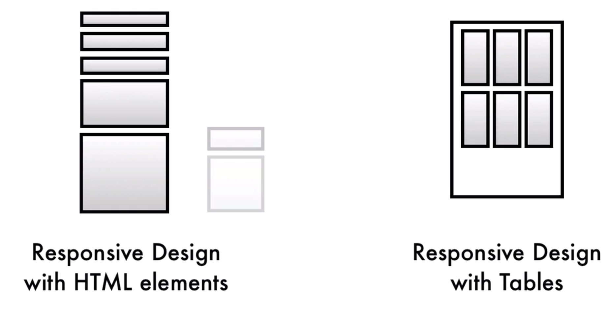
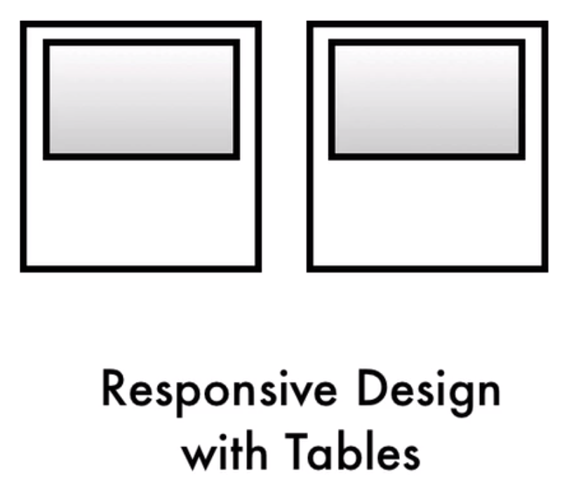
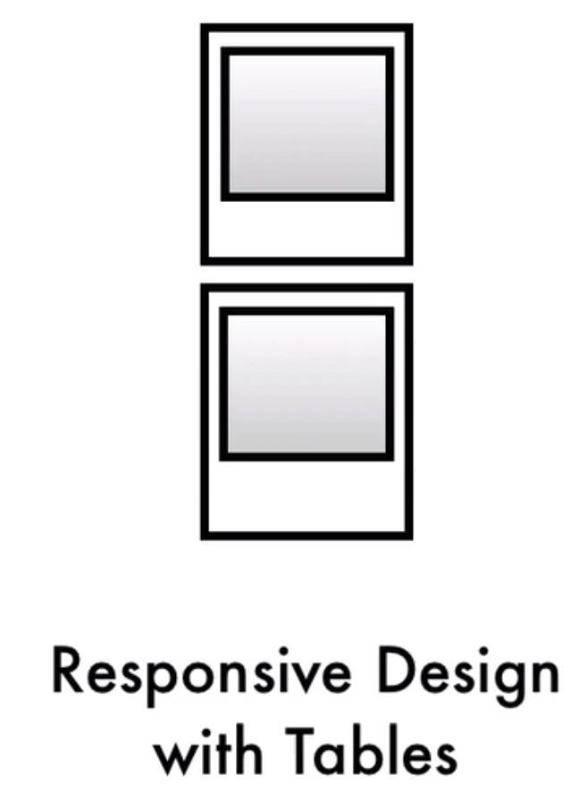
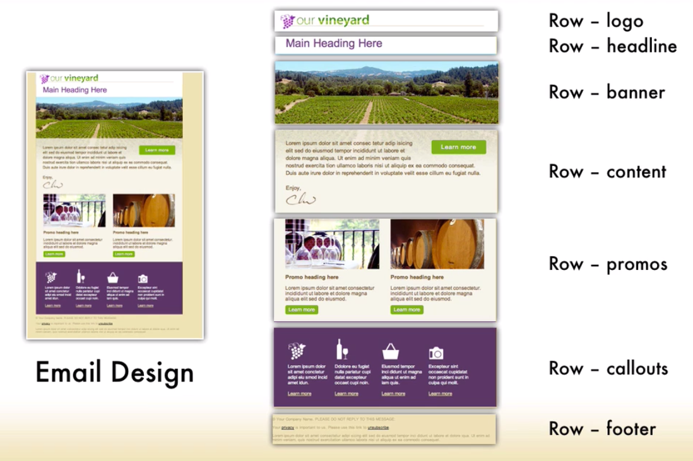

# Base Structure

Since most email client don't support the full range of `HTML` and `CSS` we need to use `tables` which is an older `layout structure` in order to get our `content` to work right in all the different clients. And this is an interesting challenge for `responsive design` as well. 



Wnen designing `responsive design` using straigt `HTML` we have the ability to take containers such as `div` tags and other elements and when we resize the browser we can move those individual elements.  



When a `table size` changes all the `<td>'s` will get smaller but we can't actually change the relationship of the individuall `<td>'s`, they are locked inside of the `table structure`.  So, we can't take one `<td>`, for example, and move it independent of all of the other ones. 



To get around this limitation, what we gonna do is put `individual content` into full `tables` that have the `single cell` inside of them. 



And then when the `width` changes we gonna move the entire `tables` around. 



So, let's start our `template`. The forst thing we gonna do is to change the `background color` inside of the `<body>` tag. Some `email clients` will support setting the color in the `<body>` tag.

### HTML
```html
<!DOCTYPE HTML PUBLIC "-//W3C//DTD HTML 4.01 Transitional//EN" "http://www.w3.org/TR/html4/loose.dtd">
<html>
	<head>
		<meta http-equiv="Content-Type" content="text/html; charset=utf-8">
		<title>Our Vineyard</title>
		<style type="text/css">
			/* css goes here */
		</style>
	</head>	
	<body bgcolor="#efe1b0">    <!--set the bg color-->

		
	</body>	
</html>
```
Next, let's add a `table cell` that's gonne be `full width` so we can center our `email`. We also can apply the `bg color` to that as well, in case the `email client` doesn't support the `<body>` tag. Next, we'll set a `table row` (`<tr>) and then `<td>` for a cell. 

### HTML
```html
<!DOCTYPE HTML PUBLIC "-//W3C//DTD HTML 4.01 Transitional//EN" "http://www.w3.org/TR/html4/loose.dtd">
<html>
	<head>
		<meta http-equiv="Content-Type" content="text/html; charset=utf-8">
		<title>Our Vineyard</title>
		<style type="text/css">
			/* css goes here */
		</style>
	</head>	
	<body bgcolor="#efe1b0">    
	<table width="100%" border="0" cellsapcing="0" cellpadding="0" bgcolor="#efe1b0">
   <!--add full width table-->
		 <tr>
         <td>
         </td>
         </tr>
	 </table>
	</body>	
</html>
```
Next, we'll create another `table` inside which is gonne be a `main container`. If we go to our full design what we gonna be doing - is taking the large screen, which is gonna be our `base design`,  and we gonna be splitting this up into `individual rows`. 



So, will have a specific `<td>` for the: logo, headline, banner, content, promos, callouts, footer. So, let's create the `main email container`. Inside of it we'll have seven `rows`. 

### HTML
```html
<!DOCTYPE HTML PUBLIC "-//W3C//DTD HTML 4.01 Transitional//EN" "http://www.w3.org/TR/html4/loose.dtd">
<html>
	<head>
		<meta http-equiv="Content-Type" content="text/html; charset=utf-8">
		<title>Our Vineyard</title>
		<style type="text/css">
			/* css goes here */
		</style>
	</head>	
	<body bgcolor="#efe1b0">    
	<table width="100%" border="0" cellsapcing="0" cellpadding="0" bgcolor="#efe1b0">
   
		 <tr>
         <td>
            <table class="container" width="640" align="center" border="0" cellpaddong="0" cellspasing="0"> <!--main email container with 7 rows inside-->
					<tr>
						<td>

						</td>
					</tr>
					<tr>
						<td>

						</td>
					</tr>
					<tr>
						<td>

						</td>
					</tr>
					<tr>
						<td>

						</td>
					</tr>
					<tr>
						<td>

						</td>
					</tr>
					<tr>
						<td>

						</td>
					</tr>
					<tr>
						<td>

						</td>
					</tr>
				</table>
         </td>
         </tr>
	 </table>
	</body>	
</html>
```

Next, we gonna styling the `row` for the `logo`. 