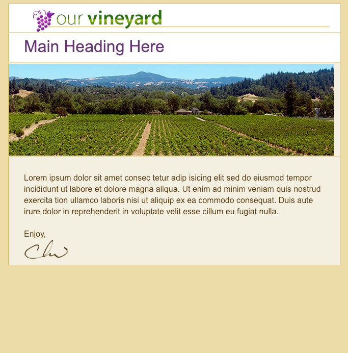

# Formatting and styling the banner & content rows

First we need to add some styling to the `<td>`. Inside we'll add an `image tag`, set `width` and `height`. Next we wanna get a `<td>` for the `content row`, and let's add styling. Then we'll add an example text, and an `image`. 

### HTML
```html
<!DOCTYPE HTML PUBLIC "-//W3C//DTD HTML 4.01 Transitional//EN" "http://www.w3.org/TR/html4/loose.dtd">
<html>
	<head>
		<meta http-equiv="Content-Type" content="text/html; charset=utf-8">
		<title>Our Vineyard</title>
		<style type="text/css">
			/* css goes here */
		</style>
	</head>	
	<body bgcolor="#efe1b0">    
	<table width="100%" border="0" cellsapcing="0" cellpadding="0" bgcolor="#efe1b0">
   
		 <tr>
         <td>
            <table class="container" width="640" align="center" border="0" cellpaddong="0" cellspasing="0"> <!--main email container with 7 rows inside-->
					<tr><!--logo row-->
						<td valign="top" class="logo" bgcolor="#ffffff" style="padding: 10px 20px 0px 30px; border-left: 1px solid #dbc064; border-right: 1px solid #dbc064; border-top: 1px solid #dbc064;"> <!--add style-->
                            <a href="#"></a> <!--add image, add margin to logo-->
						</td>
					</tr>
					<tr><!--headline row-->
						<td valign="top" class="headline" bgcolor="#ffffff"  
							style="padding: 15px 20px 5px 30px; border-left: 1px solid #dbc064; border-right: 1px solid #dbc064; font-family: Arial, Helvetica, sans-serif; font-size: 16px; line-height: 22px;">
                              <h1 style="margin: 0px 0px 15px 0px; font-weigt: normal; font-size: 32px; color: #723c7f;">Main Heading Here</h1><!--add style to the heading-->
                        </td>
                        </tr>
                        <tr><!--banner row-->
                            <td valign="top" bgcolor="#f5f2e5" class="banner" 
                        style="border-left: 1px solid #dbc064; border-right: 1px solid #dbc064;">
                           <!--add image-->
                            </td>
                        </tr>
					<tr><!--content row-->
                        <td valign="top" bgcolor="#f5f2e5" class="content" style="padding: 30px 30px 10px 30px;  
						border-right: 1px solid #dbc064; 
						border-left: 1px solid #dbc064; 
						font-family:Arial, Helvetica, sans-serif; font-size: 16px; 
                        line-height:22px; color: #654308;">
                              Lorem ipsum dolor sit amet consec tetur adip isicing elit sed do eiusmod tempor 
							  incididunt ut labore et dolore magna aliqua. Ut enim ad minim veniam quis 
							   nostrud exercita tion ullamco laboris nisi ut aliquip ex ea commodo consequat.  
							   Duis aute irure dolor in reprehenderit in voluptate velit esse cillum eu fugiat nulla.
							 <br><br>
							 Enjoy,
							 <br>
							 
							 
                        </td>
                    </tr>
				</table>
         </td>
         </tr>
	 </table>
	</body>	
</html>
```


We wanna the `background graphic` showing in the `text area` for the `browsers` that support backgrounds inside of the `<td>`. To add that we gonna add new `inline styles`. Let's go to the `<td>` tag with the `class` of "content", and inside of the `inline style` let's add a new `background property` with the `color` and the `url` of the image. 

### HTML
```html
<!DOCTYPE HTML PUBLIC "-//W3C//DTD HTML 4.01 Transitional//EN" "http://www.w3.org/TR/html4/loose.dtd">
<html>
	<head>
		<meta http-equiv="Content-Type" content="text/html; charset=utf-8">
		<title>Our Vineyard</title>
		<style type="text/css">
			/* css goes here */
		</style>
	</head>	
	<body bgcolor="#efe1b0">    
	<table width="100%" border="0" cellsapcing="0" cellpadding="0" bgcolor="#efe1b0">
   
		 <tr>
         <td>
            <table class="container" width="640" align="center" border="0" cellpaddong="0" cellspasing="0"> <!--main email container with 7 rows inside-->
					<tr><!--logo row-->
						<td valign="top" class="logo" bgcolor="#ffffff" style="padding: 10px 20px 0px 30px; border-left: 1px solid #dbc064; border-right: 1px solid #dbc064; border-top: 1px solid #dbc064;"> <!--add style-->
                            <a href="#"></a> <!--add image, add margin to logo-->
						</td>
					</tr>
					<tr><!--headline row-->
						<td valign="top" class="headline" bgcolor="#ffffff"  
							style="padding: 15px 20px 5px 30px; border-left: 1px solid #dbc064; border-right: 1px solid #dbc064; font-family: Arial, Helvetica, sans-serif; font-size: 16px; line-height: 22px;">
                              <h1 style="margin: 0px 0px 15px 0px; font-weigt: normal; font-size: 32px; color: #723c7f;">Main Heading Here</h1><!--add style to the heading-->
                        </td>
                        </tr>
                        <tr><!--banner row-->
                            <td valign="top" bgcolor="#f5f2e5" class="banner" 
                        style="border-left: 1px solid #dbc064; border-right: 1px solid #dbc064;">
                           <!--add image-->
                            </td>
                        </tr>
					<tr><!--content row-->
                        <td valign="top" bgcolor="#f5f2e5" class="content" style="padding: 30px 30px 10px 30px;  
						border-right: 1px solid #dbc064; 
						border-left: 1px solid #dbc064; 
						font-family:Arial, Helvetica, sans-serif; font-size: 16px; 
                        line-height:22px; color: #654308;  
                        background: #f5f2e5 url(images/banner_large_ghost.jpg) no repeat 0px 0px"> <!--add background image-->
                              Lorem ipsum dolor sit amet consec tetur adip isicing elit sed do eiusmod tempor 
							  incididunt ut labore et dolore magna aliqua. Ut enim ad minim veniam quis 
							   nostrud exercita tion ullamco laboris nisi ut aliquip ex ea commodo consequat.  
							   Duis aute irure dolor in reprehenderit in voluptate velit esse cillum eu fugiat nulla.
							 <br><br>
							 Enjoy,
							 <br>
							 
							 
                        </td>
                    </tr>
				</table>
         </td>
         </tr>
	 </table>
	</body>	
</html>
```